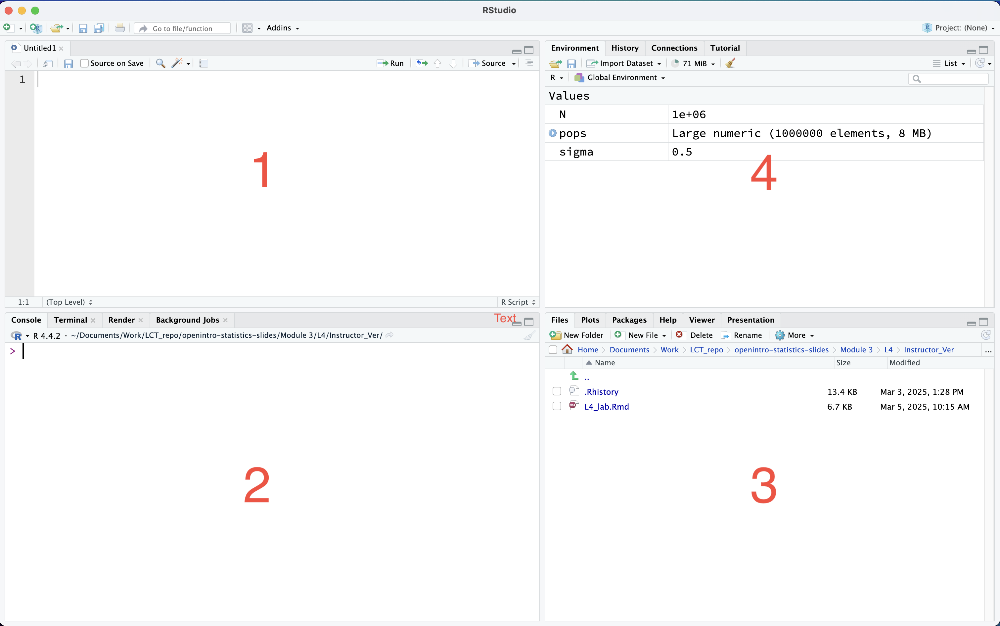
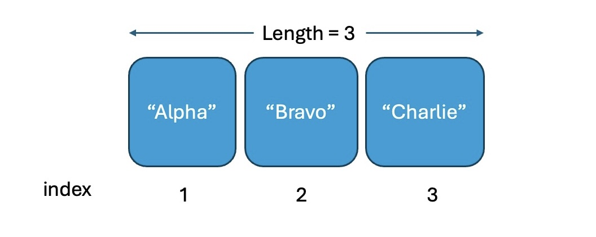
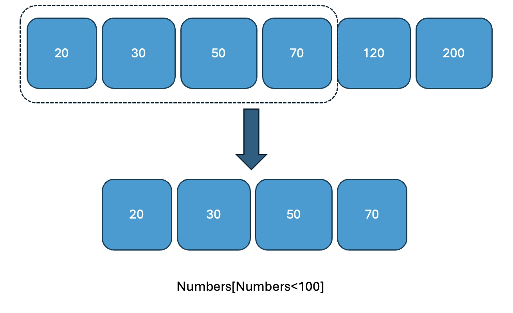

```{r setup, include=FALSE}
knitr::opts_chunk$set(echo = TRUE)
library(ggplot2)
library(dplyr)
```

## **Lab 1: Introduction to R**

In this lab session, we will learn basic syntax of R.

## Learning Objectives

- Use R for Data Management and Exploration: Utilize R to load, pre-process, and explore data through visualization and summarization techniques.

#### Install R and RStudio.

Download R from: <https://www.r-project.org/>

Download RStudio from: <https://posit.co/download/rstudio-desktop/>

(Install R first, then RStudio — RStudio is an IDE for R.)

## Introduction of R

- R is a programming language and environment for statistical computing, data manipulation, and graphics.

- R is free and open source.

- RStudio is a free, open source integrated development environment (IDE) for R.

## RStudio interface (brief)

{width="767"}

window `1` : script window (text editor)

window `2` : console (type and run R commands)

window `3` : plots, files, packages, help, etc.

window `4` : environment window

## Set up your `working directory`

Set your working directory

- Menu: Session → Set Working Directory → Choose Directory

- Or: Files tab → ☸︎ → Copy Folder Path to Clipboard, then paste into setwd()

- Or: Files tab → ☸︎ → Set As Working Directory

```{r, eval=FALSE, include=FALSE}

# replace with your own path
setwd('/path/to/your/working/directory')
getwd() # prints the current working directory

```

## How to run code?

- Type commands in the console.

- In an R Markdown chunk, click the run button ▶.

- In a script, highlight code and press Run.

- Shortcuts: Ctrl+Enter (Windows) or Cmd+Enter (Mac).

## R is a calculator: basic operations

> - Basic math operations
>
> `+`: add
>
> `-` : substract
>
> `*` : multiply
>
> `/` : divide
>
> `^` or `**`: exponentiation

For example,

$(\frac{12}{24})^2$

```{r, echo=TRUE}
(12/24)^(2) # divide 12 by 24, then square the result
(12/24)**(2) # alternative exponentiation operator

```

## Assign values to a variable

```{r, echo=TRUE}
A <- 10 # assign 10 to variable A
A <<- 10 # assign 10 to A in global environment
10 -> A # alternative assignment
10 ->> A # alternative global assignment
A = 10 # assign 10 to A using = (less common)

# A <- 10
# A = 10 
# commonly used ones 
```

And you can check what value the variable `A` has by calling it or using `print()` function

```{r, echo=TRUE}
A # calling the variable will display its value
print(A) # explicitly print the value of the variable
```

Assign strings and vectors

```{r, echo=TRUE}
SchoolName <- "Boston University"
GPA <- c(3.2, 3.7, 3.9, 2.3, 2.7)
FirstName <- c("Tom", "Sarah", "Nick", "Amy", "John")
```

```{r, echo=TRUE}
print(SchoolName)
print(GPA) 
print(FirstName) 
```

Useful vector functions

- `seq(from=a, to=b, by=c)` — generate a sequence
- `rep(x, times=n)` — replicate x n times
- `length(x)` — length of a vector

Examples

```{r, echo=TRUE}
my_vector <- seq(1, 10, 2)
another_vector <- 1:10
vector3 <- rep("BU", 25)

```

```{r, echo=TRUE}
print(my_vector)
print(another_vector)
print(vector3)

```

## Accessing vector elements

Each element in a vector is associated with index number. The index in R starts from 1 as the first item.

For example,

```{r, echo=TRUE}
#
SomeNames <- c("Alpha", "Bravo", "Charlie")


```



For example,

You can access the third element of `SomeNames` by `SomeNames[3]` .

You can also access, for example, the second and the third elements by `SomeNames[2:3]` .

```{r, echo=TRUE}
#
SomeNames[3] # third element
SomeNames[2:3] # second and third elements


```

## Numeric vector can be subsetted using condition

``` {.R style="gray"}
                         x[condition]
```

the conditional statements (condition) you can use could be

``` {.R style="yellow"}
x == 20    # x equals to 20
x < 100
x <= 100
x > 100
x >= 100
x != 100   # x not equal to 100
```

For example

```{r, echo=TRUE}
Numbers <- c(20, 30, 50, 70, 120, 200)
Numbers[Numbers < 100] # returns all numbers less than 100


```



## Creating data frames

1.  Column-wise (vectors)

```{r, echo=TRUE}

# simple column-wise construction
id <- 1:6
name <- c("Alice", "Bob", "Carol", "Dave", "Eve", "Frank")
score <- c(85, 92, 78, 90, 88, 74)
df1 <- data.frame(id = id, name = name, score = score, stringsAsFactors = FALSE)
df1

```

2.  Column-wise listing columns directly (vectors)

```{r, echo=TRUE}

# list the columns directly
df2 <- data.frame(
  region = c("North", "South", "East", "West"),
  sales  = c(1200, 950, 1100, 980),
  month  = c("Jan", "Jan", "Jan", "Jan"),
  stringsAsFactors = FALSE
)
df2

```

3.  Row-wise using `rbind()` (building up rows)

```{r, echo=TRUE}

# start empty and rbind rows (not efficient for many rows, but instructive)
df3 <- NULL
df3 <- rbind(df3, data.frame(country = "USA", pop_millions = 331, year = 2020, stringsAsFactors = FALSE))
df3 <- rbind(df3, data.frame(country = "Canada", pop_millions = 38, year = 2020, stringsAsFactors = FALSE))
df3 <- rbind(df3, data.frame(country = "Mexico", pop_millions = 128, year = 2020, stringsAsFactors = FALSE))
rownames(df3) <- NULL
df3

```

4.  Using `tibble::tibble()`

```{r, echo=TRUE}

library(tibble)
df4 <- tibble(
  student = c("Spider Man", "Iron Man", "Hulk"),
  grade   = c("A", "B", "A-"),
  points  = c(95, 82, 89)
)
df4

```

## Importing and inspecting data frames

You can import Data by using `read.csv()` function. There are many different functions to import the data, for example

```{r, echo=TRUE}

my_data <- read.csv("mtcars.csv")
read.csv("mtcars.csv", stringsAsFactors = FALSE) #— base R CSV reader (common).
read.table("mtcars.csv", header = TRUE, sep = "\t") #— base R for general delimited files.
readr::read_csv("mtcars.csv") #— fast tidyverse CSV reader (recommended for speed and consistent parsing).
```

## You can access subset data

- Specific element by `my_data[row, column]`

  - \| for example, the element in the third row and the fourth column `my_data[3,4]`

- Specific row by `my_data[row,]`

  - \| for example, all the element of the third row `my_data[3,]`

## Also,

- Specific column by `my_data[,column]`

  - \| for example, all the element of the fifth column `my_data[,5]`

- Access the column by using `$` sign such as `my_data$column_name`

  - \| for example, `hp` column from `my_data` is `my_data$hp`

- Conditional statement works similar as vectors (row wise and column wise)

  - \| for example, `my_data[my_data$hp<100,]`

## Multiple conditions can be combined

You can combine multiple logical conditions using & (AND), \| (OR), and ! (NOT) operators inside the row index to filter rows. For example

- Rows where `hp` is less than 100 AND `cyl` equals 4:

```{r, echo=TRUE}

my_data[(my_data$hp < 100) & (my_data$cyl == 4), ] # hp < 100 AND cyl = 4

```

- Rows where `hp` is less than 100 OR `cyl` equals 4:

```{r, echo=TRUE}

my_data[my_data$hp < 100 | my_data$cyl == 4, ] # hp < 100 OR cyl = 4

```

Rows where `hp` is NOT less than 100:

```{r, echo=TRUE}

my_data[!(my_data$hp < 100), ] # NOT (hp < 100)

```

## Boolean values (logical expressions)

If an expression or condition is true or false, the result in R is a logical value: TRUE or FALSE. Logical values can be used directly in expressions, indexing, and arithmetic (TRUE is treated as 1 and FALSE as 0 in numeric contexts).

Basic comparisons produce logical values:

```{r, echo=TRUE}
3 == 3    # TRUE: equality test
10 == 3   # FALSE
5 > 2     # TRUE
4 <= 4    # TRUE
7 != 9    # TRUE (not equal)
```

Using logical vectors to subset data frames:

```{r, echo=TRUE}
my_data$hp < 100           # returns a logical vector of length nrow(my_data)
my_data[my_data$hp < 100, ]# returns only rows where hp < 100
```
