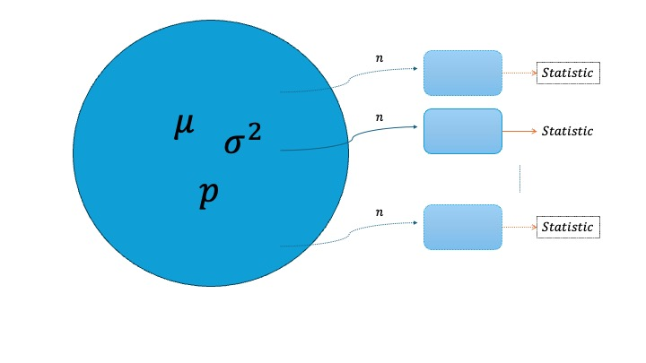
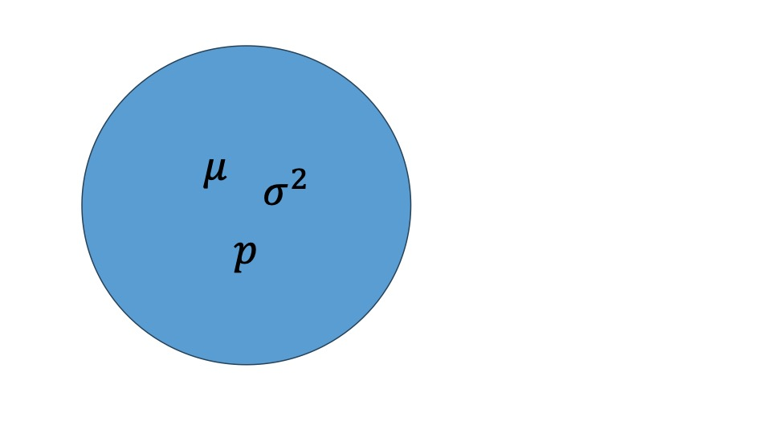
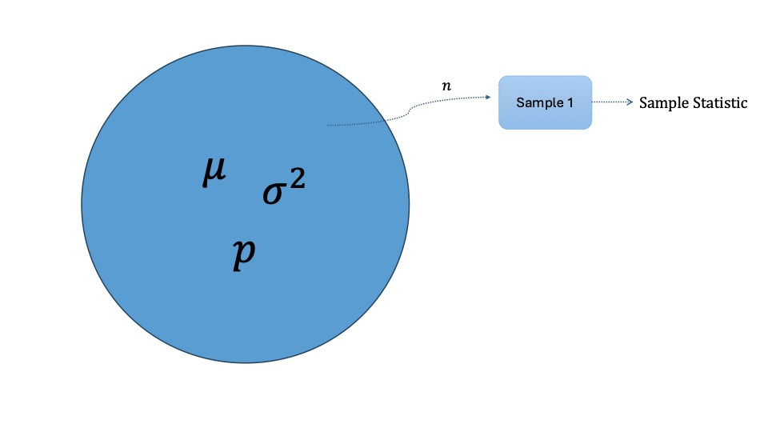
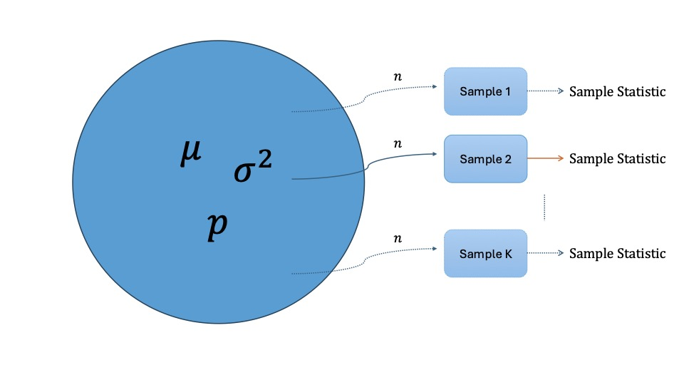

```{r setup, include=FALSE}
knitr::opts_chunk$set(echo = TRUE, warning = FALSE, message = FALSE)
library(ggplot2)
library(dplyr)
```

# **Lab 5: Sampling Distributions and the Central Limit Theorem**

In this lab session, we will explore two foundational concepts in inferential statistics: **sampling distributions** and the **Central Limit Theorem (CLT)**. Through simulation, you will see why statisticians can make reliable conclusions about a population based on a single sample — even without knowing the full population.

------------------------------------------------------------------------

## Learning Objectives

By the end of this lab, you should be able to:

-   **Apply the Law of Large Numbers:** Explain the Law of Large Numbers, why it holds, and its implications for predicting long-term averages.

-   **Model data using common distributions:** Recognize when to use the Bernoulli, Geometric, and Binomial distributions, and compute quantities of interest such as the mean, standard deviation, and tail probabilities.

-   **Use the Normal distribution:** Apply the 68–95–99.7 rule, evaluate normality through histograms and Q-Q plots, and determine when a Normal approximation to the Binomial is appropriate.

-   **Understand point estimates and sampling variability:** Define a sample statistic (point estimate) for a population parameter and explain how it varies from sample to sample.

-   **Visualize and interpret sampling distributions:** Draw and interpret sampling distributions for point estimates (e.g., sample proportions) under different sample sizes, and explain how the distribution changes as $n$ increases.

-   **Calculate and interpret standard error:** Compute the standard error for sample proportions and interpret it as a measure of sampling variability.

------------------------------------------------------------------------

## Why Do We Care About Sampling Distributions?

In inferential statistics, we use a **sample statistic** to estimate an unknown **population parameter**. For example:

-   We use the sample mean $\hat{\mu}$ to estimate the population mean $\mu$.
-   We use the sample proportion $\hat{p}$ to estimate the population proportion $p$.

But every sample is different, so every statistic we compute will be slightly different. The **sampling distribution** describes how a statistic varies across all possible samples of a fixed size $n$ drawn from the same population.

> **Key insight:** If we understand the sampling distribution, we can quantify how much our estimate might differ from the true population value — this is what makes inference possible.

{width="100%"}

------------------------------------------------------------------------

## Simulation Workflow

We use simulation to approximate the sampling distribution in three steps.

### Step 0: Create a Hypothetical Population

We begin by defining a large, known population. Because we created it, we know the true parameters (e.g., the true mean $\mu$ and standard deviation $\sigma$). This lets us check whether our sample statistics are accurate.



### Step 1: Draw a Sample and Compute the Statistic

Draw $n$ observations at random from the population. Compute the sample statistic of interest (e.g., the sample mean $\hat{\mu}$ or sample proportion $\hat{p}$).



### Step 2: Repeat $K$ Times

Repeat Step 1 a large number of times ($K$ repetitions) to build up a collection of $K$ sample statistics. The histogram of these values approximates the true sampling distribution.



------------------------------------------------------------------------

## Worked Example: Sampling Distribution of a Proportion

Suppose we have a hypothetical population of smartphone users:

```{r pop-setup}
pop <- c(rep("Apple", 10000), rep("Android", 4000))
```

The true proportion of Apple users is:

$$
p = \frac{10{,}000}{14{,}000} \approx 0.7143
$$

We want to see what happens to the **sample proportion** $\hat{p}$ when we draw repeated samples of size $n = 1{,}000$.

------------------------------------------------------------------------

### Step 0 & 1: Draw One Sample and Compute $\hat{p}$

```{r step1}
# Step 0: Define the population
pop <- c(rep("Apple", 10000), rep("Android", 4000))
true_proportion <- sum(pop == "Apple") / length(pop)
cat("True population proportion:", round(true_proportion, 4), "\n")

# Step 1: Draw one sample and compute the sample proportion
n <- 1000
my_sample <- sample(pop, size = n)
p_hat <- sum(my_sample == "Apple") / n
cat("Sample proportion (one draw):", round(p_hat, 4), "\n")
```

Notice that $\hat{p}$ is close to $p$, but not exactly equal. If you re-ran this code, you would get a slightly different value each time — this is **sampling variability**.

------------------------------------------------------------------------

### Step 2: Repeat $K$ Times to Build the Sampling Distribution

To see the full picture, we repeat the sampling process $K = 500$ times and record the sample proportion from each repetition.

> **Note:** The code chunk below uses `eval=FALSE` so that it does not run automatically. Fill in the `for` loop and run it yourself.

```{r step2, eval=FALSE}
K <- 500
p_hat_vector  <- rep(0, K)   # pre-allocate for efficiency

for (i in 1:K) {
  my_sample        <- sample(pop, size = n)
  p_hat_vector[i]  <- sum(my_sample == "Apple") / n
}

head(p_hat_vector)
```

```{r step2-hidden, echo=FALSE, include=FALSE}
# This hidden chunk pre-loads saved results so the rest of the document renders
p_hat_vector <- read.csv("p_hat_vector.csv")$x
```

------------------------------------------------------------------------

### Step 3: Visualize the Sampling Distribution

```{r step3-plot}
sample_data <- data.frame(p_hat = p_hat_vector)

ggplot(sample_data, aes(x = p_hat)) +
  geom_histogram(bins = 25, fill = "steelblue", color = "white", alpha = 0.85) +
  geom_vline(xintercept = true_proportion, color = "red", linetype = "dashed", linewidth = 1) +
  labs(
    title    = "Sampling Distribution of the Sample Proportion",
    subtitle = paste0("n = ", n, ", K = ", length(p_hat_vector),
                      "  |  Red dashed line = true p = ", round(true_proportion, 4)),
    x = expression(hat(p)),
    y = "Count"
  ) +
  theme_minimal(base_size = 13)
```

The histogram is approximately bell-shaped and centered near the true proportion $p \approx 0.714$ — this is precisely what the **Central Limit Theorem** predicts.

------------------------------------------------------------------------

## Checking Normality with the Empirical Rule

One way to assess whether $\hat{p}$ follows a Normal distribution is to apply the **68–95–99.7 rule**. For a Normal distribution:

-   Approximately **68%** of values fall within 1 standard deviation of the mean.
-   Approximately **95%** fall within 2 standard deviations.
-   Approximately **99.7%** fall within 3 standard deviations.

```{r empirical-setup}
p_hat_data <- data.frame(p_hat = p_hat_vector)

p_hat_mean <- mean(p_hat_data$p_hat)
p_hat_sd   <- sd(p_hat_data$p_hat)

cat("Mean of sample proportions: ", round(p_hat_mean, 4), "\n")
cat("SD of sample proportions:   ", round(p_hat_sd, 5), "\n")
```

### Within 1 Standard Deviation (\~68%?)

```{r check-1sd}
df  <- p_hat_data$p_hat
in_1sd <- (df > (p_hat_mean - p_hat_sd)) & (df < (p_hat_mean + p_hat_sd))
rate1 <- mean(in_1sd)   # proportion within 1 SD
cat("Proportion within 1 SD:", round(rate1, 4), "\n")
```

### Within 2 and 3 Standard Deviations

```{r check-2sd-3sd}
in_2sd <- (df > (p_hat_mean - 2 * p_hat_sd)) & (df < (p_hat_mean + 2 * p_hat_sd))
in_3sd <- (df > (p_hat_mean - 3 * p_hat_sd)) & (df < (p_hat_mean + 3 * p_hat_sd))

rate2 <- mean(in_2sd)
rate3 <- mean(in_3sd)

cat("Proportion within 2 SD:", round(rate2, 4), "\n")
cat("Proportion within 3 SD:", round(rate3, 4), "\n")
```

### Does It Pass the Test?

We check whether each observed rate is within 0.05 of the theoretical value:

```{r empirical-test}
cat("Within 0.05 of 68%?  ", abs(rate1 - 0.68) < 0.05, "\n")
cat("Within 0.05 of 95%?  ", abs(rate2 - 0.95) < 0.05, "\n")
cat("Within 0.05 of 99.7%?", abs(rate3 - 0.997) < 0.05, "\n")
```

If all three return `TRUE`, the sampling distribution of $\hat{p}$ is approximately Normal — the CLT is working.

------------------------------------------------------------------------

## 🎯 Your Turn

Work through the practice questions below. Each section builds on the concepts from the worked example. Try to answer the conceptual questions in your own words before running any code.

------------------------------------------------------------------------

### Practice 1: A Different Population

In the worked example we used a population of Apple and Android users. Now suppose the population consists of **20,000 Netflix subscribers** and **5,000 non-subscribers**.

**1a.** Create this new population and assign it to `pop2`. What is the true proportion of subscribers $p$?

```{r your-turn-1a}
# Your code here
# pop2 <- c(rep("Subscriber", 20000), rep("Non-subscriber", 5000))
# true_p2 <- ???

```

**1b.** Draw one sample of size $n = 200$ from `pop2` and compute $\hat{p}$. How close is it to the true $p$?

```{r your-turn-1b}
# Your code here

```

**1c.** Repeat the sampling $K = 1{,}000$ times and store each $\hat{p}$ in a vector called `p_hat_vector2`. Plot a histogram of the result and add a vertical dashed line at the true $p$.

```{r your-turn-1c}
# Your code here

```

**1d. Conceptual question:** Without running any code, predict what would happen to the histogram if you changed $n$ from 200 to 2,000. Would it be wider or narrower? Would the center change? Explain your reasoning.

> *Your answer here.*

------------------------------------------------------------------------
