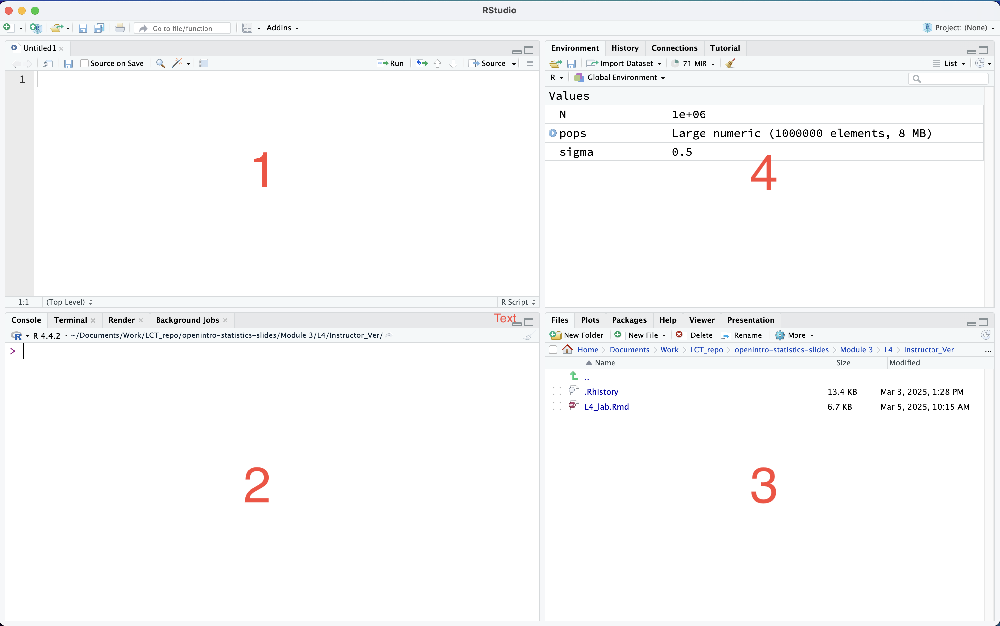

```{r setup, include=FALSE}
knitr::opts_chunk$set(echo = TRUE)
library(ggplot2)
```

# **Lab Session 1: Introduction to R**

## Basic Statistics and Probability

In this lab session, we will go over how to use R

## Pre-lab activities

What is R?

-   R is Programming language and environment statistical computing, data manipulation and graphical display.

-   R is free and open source.

-   Rstudio is also free and open source IDE (Integrated Development Environment) for R.

## Lab activities

#### Let's first install R and RStudio.

You can download and install R from

<https://www.r-project.org/>

And you can download and install RStudio from

<https://posit.co/download/rstudio-desktop/>

### Brief walk through about RStudio interface

{width="767"}

window `1` : script window (text editor)

window `2` : console window (this is where you type your R code and run)

window `3` : plots, files, packages, help... window

window `4` : environment window

### Set up `working directory`

-   You can go to `Session` → `set working directory` → `choose directory` and then choose your working directory.
-   Manually you can setup your working directory as the following.

```{r eval=FALSE, include=FALSE}

setwd('path or your working directory')

```

```{r eval=FALSE, include=FALSE}

# for example
setwd('/Users/ylim2/Documents/Work/MA213') # this will set up your working directory
getwd() # to check where you are at in term of your working directory

```

### Basic R syntax

-   `#` comments : it is used to explain the code. Anything after `#` is NOT interpreted by the R.

-   `<-` assignment operator : it assigns value/values to an object (`=` also works).

-   Commands are separated by a new line or `;` sign.

-   Objects : vectors, lists, matrices, factor, array, data frames.

```{r}
# An object has a value # logical, numeric : integer, double, character types


```

Vector

:   A vector in R is an ordered collection of values.

    Note that the indexing in R starts from 1 not from 0.

```{r}
# vector

# length function 


# Accessing vector elements

# Sorting elements of a R Vector

```

Matrices

:   Matrices are two-dimensional data structures in R

    It can be thought as a two dimensional vector.  

```{r}
# matrices

```

Factors

:   Factor is a categorical data structure in R that has a distinct levels.

```{r}
# factor


# what if we only have three Males

```

array

:   An array is a multi-dimensional data structure. Like a matrix, it can hold only one type of data.

```{r}
# array 

```

Data frame

:   Data frame is an ordered collection of vectors that must have the same length but can contain different data types.

```{r}
# data frames

```

-   Data types : character, doubles, integers, raw, logical and complex.

-   Name of an object

    1.  Object name is case sensitive. `myData` and `mydata` are not the same.

    2.  Do not start an object name with a number or `_`.

        `2day` : not okay

        `_day` : not okay

        `day2` : okay

        `day_2` : okay

    3.  Under score, dot is okay.

        `my_data` : okay

        `my.data` : confusing, but it is okay in R

    4.  Try to avoid function name

        `mean`, `sd` ...

-   R can be a calculator (some mathematics) : basic math operations to matrix operations

-   Arithmetic operators

$3+4$ : `3+4`

$4-1$ : `4-1`

$\frac{1}{10}$ : `1/10`

$x \times y$ : `x*y`

$x^{y}$ : `x^y` or `x**y`

for example

$(\frac{123}{456})^{-\frac{1}{3}}$

```{r}


```

$e^{-\frac{1}{2}}$

```{r}


```

$\log(10)$

```{r}

```

-   matrix operations

$A \times B \text{ where } A= \begin{pmatrix} 1 & 2& 3 \\ 4 &5 & 6  \end{pmatrix} \text{ and } B= \begin{pmatrix} 1 & 2 \\ 3 & 4 \\ 5 & 6   \end{pmatrix}$

```{r}

```

But A \* B performs element-wise multiplication, multiplying corresponding elements in each matrix.

```{r}


```

Inverse of a matrix

$$
\boldsymbol{A}^{-1}
$$

```{r}


```

-   logical operators

    | Operator | Description                |
    |----------|----------------------------|
    | \> a     | Greater than a             |
    | \>= a    | Greater than or equal to a |
    | \< a     | Less than a                |
    | \<= a    | Less than or equal to a    |
    | == a     | Exactly equal to a         |
    | != a     | Not equal to a             |
    | !a       | Not a                      |
    | a        | b                          |
    | a & b    | a AND b                    |

```{r}


# Greater than


# Greater than or equal to


# Less than


# Less than or equal to


# Exactly equal to


# Not equal to


# Not a (logical negation)


# OR operator


# AND operator


```

### Functions and packages

-   There are some built in functions (base functions)

``` r
mean()
sd()
sum()
length()
rep()
seq()
sqrt()
...
```

-   Packages

    ```{r}
    # loading and installing packages

    # install.packages("package name")
    # library(package name)
    ```

-   How to look at how a function is used?

    ``` r
    ?function_name
    help(function_name)

    or 

    google them
    ```

-   How to write a function

    ``` r
    function_name = function(arguments) {
      statements
      return(value)
    }
    ```

Let's make a function that is calculating sum of 3 numbers

```{r}


```

-   Best coding practice?

<https://waterdata.usgs.gov/blog/intro-best-practices/>

### Manage data

-   How to import data

-   Exploring vectors, data frame and matrices

1.  Data management in vectors, data frames, lists, matrices, missing values

2.  dplyr syntax (optional)

Importing data

Boston House Prices

<https://www.kaggle.com/datasets/vikrishnan/boston-house-prices?resource=download>

or

<https://lib.stat.cmu.edu/datasets/boston>

```{r}


```

Data cleaning

Show the houses where more than 90% of the owner-occupied units were built before 1940.

```{r}


```

How many houses are in this data?

```{r}


```

How many houses where more than 90% of the owner-occupied units were built before 1940?

```{r}


```

What is the smallest proportion of owner-occupied units that were built before 1940?

What is the largest proportion of owner-occupied units that were built before 1940?

```{r}


```

### Post-lab activities (This can be done during the lab ; at the end of the lab)

Please name your submission as `lab1.R` on GradeScope.

1.  Some mathematical questions to R

Calculate these questions and assign the answers to the corresponding objects.

a)  $$\frac{45}{9}$$

b)  $$ 25^{4}$$

c)  $$ \exp(-10) $$

For example, you would write a line of code as the following

``` r
a <- 45/9
```

d)  Create a vector with

(2,2,...,2,4,4,4) where there are 12 occurrences of 2 and 3 occurrences 4 and assign it to object `d` .

e)  You conducted a survey what courses a certain group of students are taking this semester. There are 17 for 'MA213', 5 for 'CH101' and 10 for 'MA 124'. Assign these to object `e`.

f)  You want to verify whether you can calculate the sum of the numbers from 1 to 1000. To do that, you want to create first object `f` that has numbers from 1 to 1000.

g)  Assign the sum of the numbers from 1 to 1000 that you created from f to `g` (use `f`).

<!-- -->

2.  Make a function name `quadratic` which calculate quadratic equation.

    $$
     x = \frac {-b \pm \sqrt{b^2 -4ac}} {2a}
    $$

3.  Data Question.

(a). Load the csv file `Housing.csv` and assign it to object name `mydata` .

(b). Among houses close to Charles River, what is the smallest proportion of owner-occupied units that were built before 1940? Assign the obtained proportion to `my_poportion`.

4.  Take the logarithm of the median value of owner-occupied homes (in thousands of dollars) and assign it to `LMV`.

    Find the minimum LMV value and assign it to `min_LMV`.
