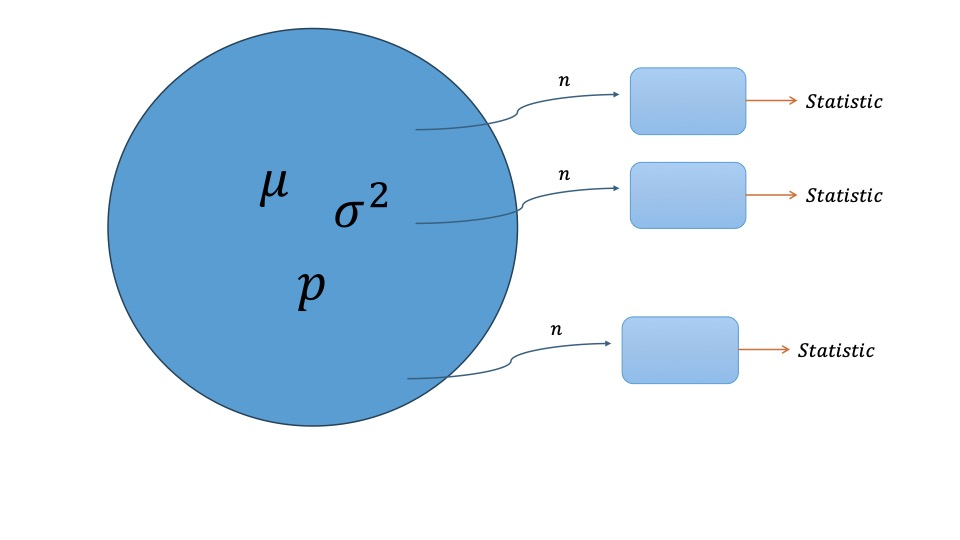

```{r setup, include=FALSE}
knitr::opts_chunk$set(echo = TRUE)
library(ggplot2)
```

# Basic Statistics and Probability

## **Lab Session 4: Simulation and probability**

In this lab session, we will go over central limit theorem. Can we verify central limit theorem by simulation?

## Pre-lab activities

-   The role of sampling distribution : Why do we care about sampling distribution?

    1.  What is sampling distribution?

    -\> In inferential statistics, we estimate the characteristics of the population parameter by using characteristics of sample (statistic).

    -\> The distribution of the statistic obtained from sample is called sampling distribution.



## Lab activities

We have a hypothetical population that are

``` r
pop <- c(rep("Apple", 10), rep("Android", 4))
```

So that the true proportion of having apple device is $p=\frac{10}{14}$.

Let's sample them with $n=5$. What is the sampling distribution look like?

1.  Let's sample them and assign it to an object `p_hat` .

    (hint : use `sample()` and how many are there are apple ?)

```{r}

```

2.  What is the sampling distribution look like? (obtain a vector `p_hat`)

    (hint : Use `for loop` )

```{r}


```

3.  Using `p_hat` vector, show sampling distribution of the statistic.

```{r}


```

4.  Now you are given much bigger hypothetical population where

    ``` r
    pop <- c(rep("Apple", 1000), rep("Android", 400))
    ```

    Now you know that the true population proportion is $p=0.7142$ .

    Let's make a function `my_sample` to give shape of distribution. (input `n`, output vector `p_hat`).

    ```{r}


    ```

5.  Using `my_sample` function, show the sampling distribution of the statistic. Change `n` from 10 to 100. What do you conclude?

```{r}


```

Can we also check that $\hat{p}$ follows a certain distribution in other ways?

(hint : 68-95-99.7 rule )

```{r}

p_hat = my_sample(1000)

p_hat_data <- data.frame(p_hat = p_hat)


```

### Post-lab activities

Recent statistics suggest that 10% of Americans rely on Social Network Sites (SNSs). We are going to have a simulation study if we can verify that Central Limit Theorem (CLT) really works in this case too. Let's assume that US population is 300,000 for calculation purposes.

Please name your submission as `lab4.R`

0.  execute this `set.seed(213)`

1.  Produce population data and assign it `population` object.

2.  Obtain mean and standard deviation of the population and assign them to `mean_pop` and `sd_pop` accordingly.

3.  Get the sample mean data for $n=10$ with $K=100$ iterations. Assign the mean and standard deviation of the sample mean data to `mean_sample` and `sd_sample`.

4.  Do one more time with the sample mean data for $n=50$ with $K=100$ iterations. Assign the mean and standard deviation of the sample mean data to `mean_sample2` and `sd_sample2`.

5.  (Extra)

    5.1) Show the shape of the sample proportion with n=10, K=1000.

    5.2) Show the shape of the sample proportion with n=1000, K=1000.

6.  With $n=1000, K =1000$, assign within 1, 2 and 3 standard deviations of the sample proportion to `first_sd_data`, `second_sd_data` and `third_sd_data`, respectively.
