# MA 213 course content source

All course materials, website sources, generators, and shared assets live in
`materials/`. The repository root retains `Chp 1/` through `Chp 9/`, this
`README.md`, and the required Git/GitHub metadata (`.gitignore` and `.github/`).
A `LICENSE` file may also remain at the root.


The MA 213 course website is built with MkDocs and hosted on GitHub Pages:

https://bu-intro-stats.github.io/MA213-basic-prob-stats/

This repository is the source for the MA 213 Basic Probability and Statistics
course materials. It contains lecture slides and agendas, lab and project
materials, learning objectives, schedule metadata, and the generated website
pages used by students.

The main instructor workflow is input-first: edit the markdown files in
`materials/instructor_inputs/`, then run one Python script to regenerate the schedule,
calendar, downloadable calendar file, Excel schedule, and MkDocs pages. The
files in `materials/generated_outputs/` and generated copies in `materials/docs/` should not be
edited by hand.

### Document organization

Course planning documents are separated by role:

- `materials/instructor_inputs/` contains instructor-edited markdown files and schedule
  source tables.
- `materials/generated_outputs/` contains files produced by the generators, including the
  weekly schedule, calendar view, calendar download, and generated Excel
  schedule.
- `materials/docs/` contains the MkDocs website source copied from the instructor inputs
  and generated outputs. Do not edit generated copies in `materials/docs/` by hand.

### Content generation flow

```mermaid
flowchart TD
    subgraph Inputs["Instructor inputs"]
        lectureSummary["materials/instructor_inputs/lecture_summary.md<br/>Lecture sequence and objectives"]
        labSummary["materials/instructor_inputs/lab_summary.md<br/>Lab and project sequence"]
        objectives["materials/instructor_inputs/learningObjectives.md<br/>Quiz, lab, and project objective tags"]
        quizSchedule["materials/instructor_inputs/quiz_schedule.md<br/>Quiz placement after lectures"]
        lecturePattern["materials/instructor_inputs/Lecture_schedules.md<br/>Lecture and meeting pattern"]
        labPattern["materials/instructor_inputs/Lab_schedules.md<br/>Lab and deliverable pattern"]
        homeworkPattern["materials/instructor_inputs/Homework_schedule.md<br/>Homework due events"]
        exceptions["materials/instructor_inputs/exceptions.md<br/>One-off calendar and schedule events"]
        dates["materials/instructor_inputs/important_dates.md<br/>Holidays, breaks, term dates"]
    end

    scheduleGen["materials/generate_schedule_table.py<br/>Assigns dates and instructor flags"]
    docsSync["Docs sync<br/>inside materials/generate_schedule_table.py"]

    subgraph Outputs["Generated outputs"]
        weekly["materials/generated_outputs/weekly_schedule.md"]
        calendar["materials/generated_outputs/calendar_schedule.md"]
        ics["materials/generated_outputs/course_calendar.ics"]
        excel["materials/generated_outputs/Weekly Schedules.xlsx"]
    end

    docs["materials/docs/<br/>MkDocs source"]
    site["GitHub Pages course site"]

    lectureSummary --> scheduleGen
    labSummary --> scheduleGen
    objectives --> scheduleGen
    quizSchedule --> scheduleGen
    lecturePattern --> scheduleGen
    labPattern --> scheduleGen
    homeworkPattern --> scheduleGen
    exceptions --> scheduleGen
    dates --> scheduleGen

    scheduleGen --> weekly
    scheduleGen --> calendar
    scheduleGen --> ics
    scheduleGen --> excel

    lectureSummary --> docsSync
    labSummary --> docsSync
    objectives --> docsSync
    weekly --> docsSync
    calendar --> docsSync
    ics --> docsSync
    docsSync --> docs --> site

    classDef input fill:#fff2cc,stroke:#d6b656,stroke-width:2px,color:#000;
    classDef source fill:#f8cecc,stroke:#b85450,stroke-width:2px,color:#000;
    classDef script fill:#dae8fc,stroke:#6c8ebf,stroke-width:2px,color:#000;
    classDef output fill:#d5e8d4,stroke:#82b366,stroke-width:2px,color:#000;
    classDef website fill:#e1d5e7,stroke:#9673a6,stroke-width:3px,color:#000;

    class lectureSummary,labSummary,objectives,quizSchedule,lecturePattern,labPattern,dates input;
    class scheduleGen,docsSync script;
    class weekly,calendar,ics,excel,docs output;
    class site website;
```



### Instructor Workflow

For routine schedule and website updates, instructors should edit only files in
`materials/instructor_inputs/`.

Common semester setup files:

1. `materials/instructor_inputs/important_dates.md` - semester year, first/last class day, holidays,
   recesses, final exam dates, and other academic calendar dates.
2. `materials/instructor_inputs/Lecture_schedules.md` - lecture, discussion, and office-hour
   meeting days/times.
3. `materials/instructor_inputs/Lab_schedules.md` - lab/project meeting day and lab
   deliverable due day/time.
4. `materials/instructor_inputs/Homework_schedule.md` - individual homework due events.
5. `materials/instructor_inputs/exceptions.md` - one-off events to add to the
   generated calendar and weekly schedule.
6. `materials/instructor_inputs/quiz_schedule.md` - quiz placement after a lecture, once
   the instructor decides where each quiz belongs.

Content files:

1. `materials/instructor_inputs/lecture_summary.md` - lecture order, topics, readings,
   and lecture learning objectives.
2. `materials/instructor_inputs/lab_summary.md` - lab/project order, purposes,
   activities, deliverables, and lab/project learning objectives.
3. `materials/instructor_inputs/learningObjectives.md` - course learning objectives and
   quiz/lab/project prerequisite tags.

After editing instructor inputs, run this from the repository root:

```bash
python3 materials/generate_schedule_table.py
```

This regenerates the weekly schedule, calendar view, `.ics` calendar file, Excel
schedule, and the MkDocs copies in `materials/docs/`. Meeting patterns are read directly
from `Lecture_schedules.md`, `Lab_schedules.md`, and `Homework_schedule.md`;
they are not duplicated in the lecture or lab summary files.

By default this is an instructor build: the local weekly schedule includes the
`Instructor Flags` column, and calendar metadata may include instructor-facing
flags. This is useful for checking prerequisite and holiday warnings before
publishing.

To preview the website locally, run:

```bash
python3 -m mkdocs serve -f materials/mkdocs.yml
```

Then open:

```text
http://127.0.0.1:8000/
```


### In short, you can just run the following commands in the shell
```bash
python3 materials/generate_schedule_table.py
python3 -m mkdocs serve -f materials/mkdocs.yml
```

To preview the public/student version locally, hide instructor flags when
generating:

```bash
MA213_PUBLIC_SITE=1 python3 materials/generate_schedule_table.py
python3 -m mkdocs serve -f materials/mkdocs.yml
```

Run `python3 materials/generate_schedule_table.py` again afterward to restore the local
instructor-facing schedule.

**Warning**

You do not need to run `python materials/build_docs.py` for routine work.
`materials/generate_schedule_table.py` already refreshes `materials/docs/`.

Do not edit
`materials/generated_outputs/weekly_schedule.md`,
`materials/generated_outputs/calendar_schedule.md`,
`materials/generated_outputs/course_calendar.ics`, or the generated copies in `materials/docs/` by
hand; they will be overwritten the next time the generator runs.

### Markdown Consistency

The instructor markdown files use a consistent, predictable pattern so they are
easy to edit and easy for the generators to parse.

General rules:

- Keep schedule metadata in markdown tables.
- Use no-space AM/PM times in instructor inputs, such as `11:15AM` and
  `10:00PM`. Generated website pages may display times with a space.
- Keep lecture, lab, and project entries as `###` sections.
- Use bold field labels in list items, such as `- **Topic:**` or
  `- **Purpose:**`.
- Use nested bullets for multi-item fields such as learning objectives,
  activities, and deliverables.

Lecture sections in `materials/instructor_inputs/lecture_summary.md` use this pattern:

```md
### Lecture 12
- **Topic:** Geometric distribution (Chapter 4.2)
- **Reading:** Chapter 4.3
- **Learning Objectives:**
  - M2.L01: Validate and Explain Probability Distributions
  - M2.L04: Understand and Compute Expectations and Variances
```

Lab/project sections in `materials/instructor_inputs/lab_summary.md` use this pattern:

```md
### Lab 5: Simulating LLN/CLT with Different Distributions

- **Lecture Anchor:** Lecture 14
- **Purpose:** Help students connect probability ideas to distributions.
- **Primary Objectives:**
  - Understand and Compute Expectations and Variances
- **Pre-Lab Activity:**
  - Review expected value and variance.
- **In-Lab Activity:**
  - Compare probability models in R.
- **Post-Lab Activity:**
  - Submit a short interpretation.
- **Deliverables:**
  - Tutorial 5
```

Schedule tables in `Lecture_schedules.md`, `Lab_schedules.md`,
`Homework_schedule.md`, `exceptions.md`, `quiz_schedule.md`, and `important_dates.md` should keep
their column names and table structure. Edit cell values, but avoid renaming
columns.

### Instructor Input Files

- `materials/instructor_inputs/lecture_summary.md` is the master lecture sequence by
  module.
- `materials/instructor_inputs/learningObjectives.md` is the master list of course
  learning objectives.
- `materials/instructor_inputs/lab_summary.md` is the master lab/project sequence by
  module.
- `materials/instructor_inputs/quiz_schedule.md` is the instructor-editable quiz placement
  table. Set
  `After Lecture` to the lecture that should immediately precede each quiz.
- `materials/instructor_inputs/Lecture_schedules.md`,
  `materials/instructor_inputs/Lab_schedules.md`,
  `materials/instructor_inputs/Homework_schedule.md`,
  `materials/instructor_inputs/exceptions.md`, and
  `materials/instructor_inputs/important_dates.md` provide the schedule metadata used to
  build weekly and calendar views.

The website copies in `materials/docs/` are derived from these files. Edit
`materials/instructor_inputs/` first, not the generated copies in `materials/docs/`.

### Website generation files

The website is generated from these planning and build files:

- `materials/instructor_inputs/Lecture_schedules.md` contains the editable
  lecture/discussion/office-hour meeting pattern table.
- `materials/instructor_inputs/Lab_schedules.md` contains the editable lab/project meeting
  pattern table.
- `materials/instructor_inputs/Homework_schedule.md` contains the editable homework due
  event table. Each row creates one homework due event.
- `materials/instructor_inputs/exceptions.md` contains editable one-off events
  that appear in the calendar and, by default, in the weekly schedule's
  `Additional Events` column.
- `materials/instructor_inputs/important_dates.md` contains the editable semester date
  table used for holidays, recesses, final exams, and other academic calendar
  dates.
- `materials/instructor_inputs/lecture_summary.md`,
  `materials/instructor_inputs/learningObjectives.md`, and
  `materials/instructor_inputs/lab_summary.md` are the ground-truth planning files used by
  the website.
- `materials/instructor_inputs/quiz_schedule.md` controls where quiz events are inserted
  into the lecture sequence. The schedule generator assigns each quiz to the
  next regular class meeting after its `After Lecture` value.
- `materials/generate_schedule_table.py` reads the course schedule information and creates
  `materials/generated_outputs/weekly_schedule.md`,
  `materials/generated_outputs/calendar_schedule.md`,
  `materials/generated_outputs/course_calendar.ics`, and
  `materials/generated_outputs/Weekly Schedules.xlsx`. It also syncs the MkDocs source
  pages in `materials/docs/` and adds instructor flags when scheduled lectures, quizzes,
  labs, or projects fall on or near holidays,
  recesses, or other important dates, or when prerequisites have not yet been
  covered.
- `materials/build_docs.py` is a small compatibility helper that only copies source pages
  into `materials/docs/`; routine schedule updates do not need it because
  `materials/generate_schedule_table.py` syncs `materials/docs/` automatically.
- `materials/mkdocs.yml` defines the site navigation, theme, and build settings.

Edit the source files under `materials/` first, not the generated copies in `materials/docs/`.
`materials/generate_schedule_table.py` refreshes the MkDocs pages from the
ground-truth files under `materials/instructor_inputs/`.

### Reusable Course Package

The schedule generator now lives in the local Python package
`course_site_builder`. The `materials/generate_schedule_table.py` file is a thin
MA 213 wrapper:

```py
from pathlib import Path

from course_site_builder.schedule import CourseSiteConfig, main


if __name__ == "__main__":
    main(CourseSiteConfig.for_repo(Path(__file__).resolve().parent, "MA213", course_title="MA 213"))
```

This keeps the instructor workflow unchanged:

```bash
python3 materials/generate_schedule_table.py
```

The package also exposes a command-line interface. From a source checkout, use:

```bash
PYTHONPATH=materials python3 -m course_site_builder --course-code MA213 --course-title "MA 213"
```

After installing the package, the equivalent command is:

```bash
course-site-builder --course-code MA213 --course-title "MA 213"
```

For the public/student version, either set the course-specific environment
variable or pass `--public`:

```bash
course-site-builder --course-code MA213 --course-title "MA 213" --public
```

For another course repository, such as MA 214, copy the package directory or
install this package, keep the same `materials/instructor_inputs/`, `materials/generated_outputs/`,
and `materials/docs/` folder pattern, and create a course-specific wrapper. An example is
provided in `materials/examples/MA214_generate_schedule_table.py`:

```py
from pathlib import Path

from course_site_builder.schedule import CourseSiteConfig, main


if __name__ == "__main__":
    main(CourseSiteConfig.for_repo(Path(__file__).resolve().parent, "MA214", course_title="MA 214"))
```

The public-site environment variable is based on the course code. For MA 214,
the public build command would be:

```bash
MA214_PUBLIC_SITE=1 python3 materials/examples/MA214_generate_schedule_table.py
```

By default, the reusable package uses the same folder and markdown filenames as
MA 213: `materials/instructor_inputs/`, `materials/generated_outputs/`, `materials/docs/`,
`lecture_summary.md`, `lab_summary.md`, `learningObjectives.md`,
`quiz_schedule.md`, `Lecture_schedules.md`, `Lab_schedules.md`,
`Homework_schedule.md`, `exceptions.md`, and `important_dates.md`. Another course can override
those names in its wrapper:

```py
main(
    CourseSiteConfig.for_repo(
        Path(__file__).resolve().parent,
        "MA214",
        course_title="MA 214",
        term_year=2026,
        learning_objectives_filename="learning_objectives.md",
        xlsx_filename="Weekly Schedule.xlsx",
    )
)
```

Common `CourseSiteConfig` overrides:

- `term_year`: fallback calendar year when `important_dates.md` does not state
  the semester year.
- `local_timezone`: timezone used in the generated `.ics` calendar.
- `instructor_inputs_dir`, `generated_outputs_dir`, `docs_dir`: root folder
  names or paths.
- `lecture_summary_filename`, `lab_summary_filename`,
  `learning_objectives_filename`, `quiz_schedule_filename`,
  `lecture_schedule_filename`, `lab_schedule_filename`,
  `homework_schedule_filename`,
  `exceptions_filename`, `important_dates_filename`: instructor input filenames.
- `weekly_schedule_filename`, `calendar_schedule_filename`,
  `calendar_ics_filename`, `xlsx_filename`: generated output filenames.
- `docs_*_filename`: destination names for files copied into `materials/docs/`.

When setting up another course, put the wrapper at the root of that course
repository as `materials/generate_schedule_table.py`. The example file lives in
`materials/examples/` only as a template; it is not part of the routine MA 213 build.

### Editable schedule inputs

Lecture, discussion, and office-hour meeting days are controlled by
the table in `materials/instructor_inputs/Lecture_schedules.md`:

```md
| Event Type    | Weekdays                 | Start Time | End Time |
| ---           | ---                      | ---        | ---      |
| Lecture       | Monday, Wednesday, Friday | 11:15AM  | 12:05PM |
| Discussion    | Thursday                 | 12:20PM   | 1:10PM  |
| Office Hour 1 | Friday                   | 3:00PM    | 4:00PM  |
| Office Hour 2 | Monday                   | 4:00PM    | 5:00PM  |
```

Homework due dates are controlled by `materials/instructor_inputs/Homework_schedule.md`.
Each row creates one homework due event; delete rows for weeks with no homework.
Homework uses only `End Time`, which is treated as the due time:

```md
| Homework | Week | Weekday | End Time | Details |
| --- | --- | --- | --- | --- |
| Homework 1 | 1 | Sunday | 3:00PM | Weekly homework component. |
| Homework 3 | 3 | Sunday | 3:00PM | Weekly homework component. |
```

One-off events are controlled by `materials/instructor_inputs/exceptions.md`.
Use this when an event needs to be squeezed into the calendar and weekly
schedule without changing the recurring lecture or lab pattern:

```md
| Date | Event Type | Title | Start Time | End Time | Details | Include in Schedule | Schedule Note |
| --- | --- | --- | --- | --- | --- | --- | --- |
| October 7 | Review Session | Midterm Review | 5:00PM | 6:00PM | Optional review before Quiz 2. | Yes | Midterm Review, 5:00PM-6:00PM |
```

`Date` may be written as `October 7`, `2026-10-07`, `10/7/2026`, or
`10/7`. Rows are added to the calendar and `.ics` file. They also appear in
the weekly schedule's `Additional Events` column unless `Include in Schedule`
is set to `No`.

Lecture topics, readings, and lecture learning objectives are maintained in
`materials/instructor_inputs/lecture_summary.md`. Keep objective codes in the form
`M1.L01` so prerequisite checks can match them against
`materials/instructor_inputs/learningObjectives.md`.

Lab and project meeting days are controlled by the table in
`materials/instructor_inputs/Lab_schedules.md`:

```md
| Event Type      | Weekday   | Start Time | End Time |
| ---             | ---       | ---        | ---      |
| Lab / Project   | Wednesday |            |          |
| Lab Deliverable | Tuesday   |            | 10:00PM |
```

Lab and project details are maintained directly in
`materials/instructor_inputs/lab_summary.md`. Use the normalized lab/project section
syntax shown in `Markdown Consistency`.

Quiz placement is controlled by `materials/instructor_inputs/quiz_schedule.md`:

```md
| Quiz | After Lecture | Status | Notes |
| --- | --- | --- | --- |
| Quiz 1 | Lecture 8 | tentative |  |
```

This means Quiz 1 is scheduled at the next regular class meeting after Lecture
8. Update only the `After Lecture`, `Status`, and `Notes` cells when quiz timing
changes.

Prerequisite flags are inferred from `materials/instructor_inputs/learningObjectives.md`.
Quiz flags use the `Quiz#` tags, lab flags use the `Lab#` tags, and project flags use
the `Project1` or `Project2` tags. If an event has no matching learning-objective tag, the
weekly schedule and calendar show a missing-prerequisite-metadata flag so the
instructor knows where an explicit prerequisite entry is needed.

### Instructor Flags

`Instructor Flags` are generated by `materials/generate_schedule_table.py` as an
instructor-only audit column. They are meant to help instructors spot schedule
problems before publishing the student-facing site.

The script creates flags from three sources:

1. Academic calendar timing:
   - Dates come from `materials/instructor_inputs/important_dates.md`.
   - Events are flagged if they fall on a holiday, class suspension, recess,
     study period, last day of classes, or substitute schedule day.
   - Events are also flagged when they are within two days of one of those
     important dates, using wording such as `Near Thanksgiving Recess`.
2. Learning-objective prerequisites:
   - Lecture objective codes come from `materials/instructor_inputs/lecture_summary.md`,
     using codes such as `M2.L04`.
   - Quiz/lab/project prerequisite tags come from
     `materials/instructor_inputs/learningObjectives.md`, using tags such as `Quiz2`, `Lab5`,
     `Project1`, or `Project2`.
   - The script checks whether each prerequisite objective has already appeared
     in a prior lecture.
3. Missing or mismatched metadata:
   - If an event has no matching prerequisite tag, the script writes a missing
     prerequisite metadata flag.
   - If a prerequisite tag points to an objective that never appears in the
     lecture summary, the script writes a prerequisite-not-found flag.

Common prerequisite flag meanings:

- `Prerequisite not yet covered`: the objective first appears after the quiz,
  lab, or project event.
- `Prerequisite may be same-day`: the objective first appears on the same date
  as the quiz, lab, or project event.
- `Missing prerequisite metadata`: the quiz, lab, or project does not have a
  matching `Quiz#`, `Lab#`, `Project1`, or `Project2` tag in
  `learningObjectives.md`.

The local instructor build shows these flags:

```bash
python materials/generate_schedule_table.py
python -m mkdocs serve -f materials/mkdocs.yml
```

The public/student build hides these flags:

```bash
MA213_PUBLIC_SITE=1 python materials/generate_schedule_table.py
python -m mkdocs serve -f materials/mkdocs.yml
```

GitHub Actions uses the public build setting automatically, so the deployed
course website does not show the `Instructor Flags` column.

Academic dates are controlled by the table in
`materials/instructor_inputs/important_dates.md`:

```md
| Start Date   | End Date    | Event                                             |
| ---          | ---         | ---                                               |
| September 2  |             | Classes Begin; First Seven-Week Session Begins    |
| November 25  | November 29 | Thanksgiving Recess                               |
```

Blank `End Date` values are treated as one-day events. Dates in January are
treated as belonging to the following calendar year for a fall semester.

### Local workflow

After editing files in `materials/instructor_inputs/`, run:

```bash
python materials/generate_schedule_table.py
```

This is the only required generator for routine instructor work. It updates
`materials/generated_outputs/` and `materials/docs/`. This local instructor build includes the
`Instructor Flags` column.

To generate the public/student version locally without instructor flags:

```bash
MA213_PUBLIC_SITE=1 python materials/generate_schedule_table.py
```

To preview the website locally:

```bash
python -m mkdocs serve -f materials/mkdocs.yml
```

Then open:

```text
http://127.0.0.1:8000/
```

To create a static local site build without serving it:

```bash
python -m mkdocs build --strict -f materials/mkdocs.yml
```

That writes the built website to `materials/site/`. For the public course website, commit
the updated source/generated files and push to `master`; GitHub Actions builds
and deploys the site.

The monthly calendar page is available at:

```text
http://127.0.0.1:8000/calendar_schedule/
```

The calendar page includes a download menu for Google Calendar, Apple Calendar,
and Outlook. These choices all use the generated
`materials/generated_outputs/course_calendar.ics` file.

If port `8000` is already in use, run the server on another port:

```bash
python -m mkdocs serve -a 127.0.0.1:8001 -f materials/mkdocs.yml
```

Stop the local server with `Ctrl+C` in the terminal where it is running.

The generated MkDocs pages live in `materials/docs/`:

- `materials/docs/weekly_schedule.md`
- `materials/docs/calendar_schedule.md`
- `materials/docs/course_calendar.ics`
- `materials/docs/lecture_summary.md`
- `materials/docs/lab_summary.md`
- `materials/docs/learning_objectives.md`
- `materials/docs/index.md`

The GitHub Actions workflow in `.github/workflows/deploy-site.yml` installs the
Python dependencies, regenerates schedule/site output with
`MA213_PUBLIC_SITE=1`, runs `mkdocs build --strict -f materials/mkdocs.yml`, uploads the built `materials/site/`
artifact, and deploys it with `actions/deploy-pages`. The deployed public site
does not show the `Instructor Flags` column. Run the full local workflow above
before committing when you have changed `materials/instructor_inputs/lecture_summary.md`,
`materials/instructor_inputs/learningObjectives.md`,
`materials/instructor_inputs/lab_summary.md`, `materials/instructor_inputs/quiz_schedule.md`, or
schedule source files in `materials/instructor_inputs/`, especially `important_dates.md`,
`Lecture_schedules.md`, `Lab_schedules.md`, or `Homework_schedule.md`.

This site is deployed with GitHub Actions, not GitHub Pages Jekyll. In the
repository settings, GitHub Pages should be configured with:

- Source: GitHub Actions

Deployment runs automatically when changes are pushed to `master`. It can also
be run manually from the Actions tab using the `Deploy course site` workflow.
If deployment fails with `Creating Pages deployment failed` or `HttpError: Not
Found`, check that GitHub Pages is enabled and that the source is set to
`GitHub Actions` under Settings -> Pages.

## Slide license notes

These slides are available at http://www.openintro.org under a Creative Commons Attribution-NonCommercial-ShareAlike 3.0 Unported license (CC BY-NC-SA):

http://creativecommons.org/licenses/by-nc-sa/3.0/

This file describes guidelines for when the slides' source files are modified and/or shared. The CC BY-SA license guidelines supercede any guidelines put forth in this file; follow the CC BY-SA license if there is any discrepancy between that license and these guidelines.

1. Communication obligation. Any derivative work must communicate that it is licensed under a CC BY-SA license, and it also must in some way include the attribution content contained in the footnote on the first page of the original document.

2. Derivative title. No derivative may include "OpenIntro" in the title, unless it is included in text of the form "Derivative of OpenIntro", e.g. one might add a subtitle such as "Derivative of OpenIntro Slides".

3. For derivative works, we suggest but do not require that contributing authors' names be listed in chronological order of their contribution.
