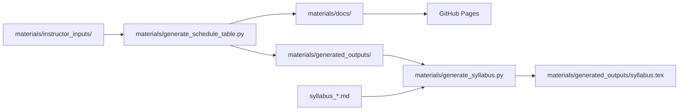

# MA 213 course content

This repository contains the source files for the MA 213 course website.

Website: <https://bu-intro-stats.github.io/MA213-basic-prob-stats/>

## Content generation flow



## Instructor workflow

1. Edit the files in `materials/instructor_inputs/`.
2. Generate the schedule and website files:

   ```bash
   python3 materials/generate_schedule_table.py
   ```

3. Generate the LaTeX syllabus:

   ```bash
   python3 materials/generate_syllabus.py
   ```

4. Check the results in `materials/generated_outputs/` and `materials/docs/`.
5. Commit and push the changes to `master` to publish the website.

Do not edit generated files in `materials/generated_outputs/` or `materials/docs/`.

## Main input files

- `lecture_summary.md` — lecture topics and learning objectives
- `lab_summary.md` — lab and project information
- `learningObjectives.md` — course learning objectives
- `Lecture_schedules.md` — lecture and office-hour schedule
- `Lab_schedules.md` — lab and project schedule
- `Homework_schedule.md` — homework due dates
- `quiz_schedule.md` — quiz placement
- `exception_schedules.md` — one-time events
- `important_dates.md` — holidays, recesses, and term dates

All files are in `materials/instructor_inputs/`.

## Syllabus input files

- `syllabus_course.md` — course details, description, and materials
- `syllabus_staff.md` — instructor and teaching staff information
- `syllabus_grading.md` — grading system and requirements
- `syllabus_assessments.md` — homework and quiz information
- `syllabus_lab.md` — skills labs, lab projects, and peer evaluation
- `syllabus_policies.md` — course policies

The syllabus generator also uses the learning objectives, semester dates, and
`materials/generated_outputs/weekly_schedule.md`. It writes
`materials/generated_outputs/syllabus.tex`, with Course Staff immediately after
the lecture, discussion, and lab meeting information.

## Preview the website locally

```bash
python3 -m mkdocs serve -f materials/mkdocs.yml
```

Open <http://127.0.0.1:8000/>.

To preview the public/student version without instructor flags:

```bash
MA213_PUBLIC_SITE=1 python3 materials/generate_schedule_table.py
python3 -m mkdocs serve -f materials/mkdocs.yml
```
