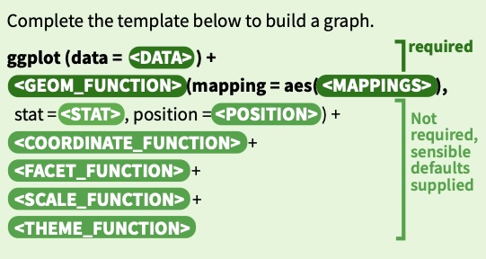

```{r setup, include=FALSE}
knitr::opts_chunk$set(echo = TRUE)
library(ggplot2)
library(dplyr)
```

# **Lab 2: Plotting and Summaries**

In this lab, we learn how to analyze variables in real datasets using pre-processing, data exploration through visualization, and summarization techniques in R.

We will go over also slightly advanced functions for summarization and visualization using `tidyverse` package which includes `dplyr` and `ggplot2` packages.

------------------------------------------------------------------------

#### Learning Objectives

- Classify and Analyze Variables: Categorize variables based on their types (e.g., numerical/categorical, continuous/discrete, ordinal), assess their association (positive, negative, or independent), and determine which make sense as explanatory vs. response variables.
- Use R for Data Management and Exploration: Utilize R to load, pre-process, and explore data through visualization and summarization techniques.

------------------------------------------------------------------------

## Pre-lab activities

-   We are going to work in groups. Let’s form pairs. You can discuss the exercise questions and post-lab activities with your members.

```{r}
# grouping code for lab
# total number of students in the lab today
student_list = read.csv("StudentList.csv")
N = dim(student_list)[1]
student_list = sort_by(student_list, student_list$Last)
student_list$number = 1:N

if (N%%2==0){ # if N is even number
half = N/2
}else{ # if N is odd number
  half = round(N/2) # this will make sure half is an integer
}

# half

total_group <- 1:N
group1 <- sample(total_group, half)
index <- total_group %in% group1
index <- index==FALSE # which ones are not in group1 in total_group
group2 <- total_group[index]

if (length(group1)==length(group2)){
df = cbind(group1, group2)
}else if(length(group1)<length(group2)){
  group1 = append(group1, 0)
  df = cbind(group1, group2)
}

 

group_df <- data.frame(group1, group2)
# group_df


group_df1 <- left_join(group_df, student_list, by=join_by(group1 == number))


group_df_final <- left_join(group_df1, student_list, by=join_by(group2 == number))


group_df_final
```

## Lab activities

In this lab, we are going to go over New York air quality dataset.

The following is the description of the dataset.

#### **New York Air Quality Dataset**

> Description :
>
> Daily air quality measurements in New York, May to September 1973 stored within a data frame with 153 observations on 6 variables. It is obtained from the New York State Department of Conservation (ozone data) and the National Weather Service (meteorological data).
>
> Variables in the data frame :
>
> | Name | Details |
> |------------------------------------|------------------------------------|
> | Ozone | Mean ozone in parts per billion (ppb) from 1300 to 1500 hours at Roosevelt Island |
> | Solar.R | Solar radiation in Langleys (lang) in the frequency band 4000–7700 Angstroms from 0800 to 1200 hours at Central Park |
> | Wind | Average wind speed in miles per hour (mph) at 0700 and 1000 hours at LaGuardia Airport |
> | Temp | Maximum daily temperature in degrees Fahrenheit (degrees F) at LaGuardia Airport. |
> | Month | Month (1–12) |
> | Day | Day of month (1–31) |
>
> The values are *daily readings of the air quality values for May 1, 1973 (a Tuesday) to September 30, 1973.*
>
> It is cited by @chambers2018graphical.

Load some packages for plotting and summaries.

```{r}
library(ggplot2) # library for plotting 

library(dplyr) # library for data wrangling 
library(tidyr)
```

You can use `airquality` object from base R datasets. You can also `airquality.csv` file where the dataset is stored as a comma separated value (CSV) file. Each row holds information for a single observation.

#### Briefly walking around Data

Some useful functions to look at the data

> `head(df)`: Displays the first six rows of the data frame.
>
> `tail(df)`: Displays the last six rows of the data frame.
>
> `str(df)`: Shows the structure of the data frame, including column types and sample values.
>
> `dplyr::glimpse(df)`: Provides a transposed, compact view of the data frame, making it easier to read.
>
> `is.na(df)`: Returns a logical values indicating missing (`NA`) values in the data frame.
>
> `na.omit(df)`: Removes rows with missing values (`NA`s) from the data frame. `unique(x)` : Returns a vector, data frame or array like x but with duplicate elements/rows removed.

Load the data from `airquality.csv` and show first 6 rows to see how this data is organized.

```{r}
df = read.csv("airquality.csv")
head(df) 
```

or

```{r}

dplyr::glimpse(df)

```

Let's check if we have a missing value in the data.

```{r}
head(is.na(df))

```

Let's work without missing value this time.

```{r}

df_filtered <- na.omit(df)
head(df_filtered)


```

### \* `tidyverse` package

`tidyverse` is a collection of R packages that includes famous data manipulation package `dplyr`, powerful data visualization package `ggplot2` (<https://github.com/tidyverse>).

#### Data wrangling using `dplyr` package

> `%>%` : pipes operator
>
> It takes the output of the expression on its left and passes it as the first argument to the function on its right (it works like "`and then"` in English).
>
> We are briefly going over some basic functionalists in `dplyr` packages.
>
> `select()` : Select columns from a data frame
>
> `filter()` : Filter rows based on conditions
>
> `mutate()` : Create or modify columns
>
> `group_by()` : Group data for aggregation (Groups data based on one or more variables)
>
> `summarise()` : Summarize data (Reduces data to summary statistics, like mean, sum, count, etc)

If you want `Ozone`, `Temp` and `Month` columns only from the dataset

```{r}

df_filtered %>%
  select(Ozone, Temp, Month)


```

You want only May data only

```{r}

df_filtered %>% 
  select_all() %>%
  filter(Month == 5)
  


```

You want the temperature in Celsius.

```{r}

df_filtered %>%
  mutate(Temp_C = (Temp-32)*(5/9))


```

You want to see the average temperature by Month in Celcious.

```{r}
df_filtered %>%
  mutate(Temp_C = (Temp-32)*(5/9)) %>%
  group_by(Month) %>%
  summarise(avg_temp_C = mean(Temp_C))

```

#### \* Graphics with `ggplot2` package

Plotting with `ggplot2` package begins with

`ggplot(data = df, aes(x=x_xvariable, y=y_variable))`

where

`df` : your dataframe name,

`aes()` : Aesthetics to define -\> specifying which variables are mapped to the x and y axes.

and then you add `geoms` functions – geometrical objects as a graphical representation of the data in the plot (points, lines, bars). **`ggplot2`** offers many different geoms; We will use a few common ones today, including:

-   `geom_point()` : scatter plots, dot plots, etc.

-   `geom_line()` : trend lines, time-series, etc.

-   `geom_histogram()` : histograms

In short,

[](https://github.com/rstudio/cheatsheets/blob/main/data-visualization.pdf)

```{r}

# ggplot version
ggplot(data=df_filtered, mapping=aes(x=Ozone, y=Temp)) + 
  geom_point()


```

### Exercise

#### Q. Let’s talk about the variables in the dataset. What is numerical data, and what is categorical data? Can we also identify variables of interest and discuss possible hypotheses?

```{r}
head(df_filtered)

help("airquality") # You can also access the documentation of the data using help()
```

### Numerical Data Analysis

We want to examine the shape of `Ozone` to see whether the data is symmetric, skewed or how the mean is centered and where...? Let's see how this `Ozone` data is shaped by using several different methods.

1.  Summary of `Ozone`.

```{r}

summary(df_filtered$Ozone)
```

2.  Dot plot of `Ozone`.

```{r}

stripchart(df_filtered$Ozone)

```

3.  Stacked dot plot of `Ozone` .

```{r}
mean_ozone <- mean(df_filtered$Ozone)
stripchart(df_filtered$Ozone, method = "stack")
# add a point 
points(mean_ozone, 1, col="red", pch=19, cex = 1.5)


median_ozone <- median(df_filtered$Ozone)
stripchart(df_filtered$Ozone, method = "stack")
# add a point 
points(median_ozone, 1, col="red", pch=19, cex = 1.5)


```

ggplot2 version

```{r}
ggplot(data = df_filtered, aes(Ozone)) + 
  geom_dotplot() + 
  geom_vline(xintercept = median_ozone, color="red")

```

4.  Box plot of `Ozone`.

```{r}
boxplot(df_filtered$Ozone)

```

ggplot2 version

```{r}
ggplot(data=df_filtered, aes(Ozone)) +
  geom_boxplot()

```

5.  Histogram of `Ozone` .

```{r}

hist(df_filtered$Ozone)

# you can change the breaks
hist(df_filtered$Ozone, breaks=12)


# Fancy version of histogram
hist(df_filtered$Ozone, breaks = 12, main = "Histogram of Ozone", xlab = "Ozone",col = "pink")

# Add mean line
abline(v = mean(df_filtered$Ozone, na.rm = TRUE), col = "red", lwd = 2, 
       lty = 2) 

# Add median line
abline(v = median(df_filtered$Ozone, na.rm = TRUE),col = "blue", lwd = 2, 
       lty = 2)  # dashed line

# Add a legend
legend("topright", legend = c("Mean", "Median"), 
       col = c("red", "blue"), lty = 2, lwd = 2)


```

ggplot2 version

```{r}
# ggplot version

ggplot(data=df_filtered ) + 
  geom_histogram(mapping=aes(Ozone), binwidth = 5) +
  geom_vline(xintercept = median_ozone, color = "red") 
  

```

6.  Histogram of `Ozone` with different bins/breaks to show more information.

```{r}

hist(df_filtered$Ozone, breaks=30)


```

ggplot2 version

```{r}

# ggplot version

ggplot(data=df_filtered ) + geom_histogram(aes(Ozone), bins = 5)


ggplot(data=df_filtered, aes(Ozone)) + 
  geom_histogram(bins = 30) 

# breaks in hist() and bins in geom_histogra() works differently 
```

ggplot2 with labels

```{r}


ggplot(data=df_filtered, aes(Ozone)) + 
  geom_histogram(bins = 30, color='yellow') +
  labs(x='Ozone Level', title = 'Histogram with 30 bins')


```

We want to examine whether there is a relationship between ozone and temperature. How do we want to approach this?

7.  Scatter plot of `Ozone` and `Temp` .

```{r}

plot(df_filtered$Temp, df_filtered$Ozone)

```

ggplot version

```{r}

ggplot(df_filtered) + geom_point(aes(x=Ozone, y=Temp)) + 
  labs(title='Scatter plot of Ozone vs Temperature')


```

### Exercise

#### Q. You are interested in Ozone level excluding May. You want to see how Ozone level is distributed in June, July, August and September by looking at some plots.

```{r}


```

#### Q. You want to see how average speed of wind changes over time (Month). Can you visualize it?

```{r}


```

#### Q. Do you see any patterns of level of Ozone over time?

```{r}


```

## Categorical Data

We are going to see the famous `Titanic` dataset.

#### **Survival of Passengers on the Titanic**

> **Description**:\
> This data set provides information on the fate of passengers on the fatal maiden voyage of the ocean liner *Titanic*.
>
> ### **Variables in the Data Frame**
>
> | Variable | Definition | Key |
> |------------------------|------------------------|------------------------|
> | `survival` | Survival | 0 = No, 1 = Yes |
> | `pclass` | Ticket class | 1 = 1st (Upper), 2 = 2nd (Middle), 3 = 3rd (Lower) |
> | `sex` | Sex of the passenger | male / female |
> | `age` | Age in years | Age is fractional if \< 1; estimated ages are xx.5 |
> | `sibsp` | \# of siblings / spouses aboard the Titanic | the number of siblings and/or \>spouses aboard |
> | `parch` | \# of parents / children aboard the Titanic | the number of parents and/or \>children aboard |
> | `ticket` | Ticket number |  |
> | `fare` | Passenger fare |  |
> | `cabin` | Cabin number | many missing |
> | `embarked` | Port of Embarkation | C = Cherbourg, Q = Queenstown, S = Southampton |
>
> Source : <https://www.kaggle.com/competitions/titanic/data>

------------------------------------------------------------------------

Instead of `Titanic` dataset from base R, we are going to work with raw dataset `titanic.csv`. Let's load the data.

```{r}
# loading from csv file
df <- read.csv("titanic.csv")
head(df)

# maybe we can also show built in Titanic data
# but this data is already table df

```

Which one is numerical variable and which one is categorical variable?

How do we know? Let's discuss about them.

```{r}
summary(df)


```

1.  Show the contingency table for `Pclass` vs `Survived` .

```{r}

df2 <- df[,2:3]
table_data <- table(df2)
print(table_data)


```

dplyr and tidyr version \> `tidyr` package has some functions to organize tablular data.

```{r}
# tidyr version

table_data <- df %>% 
  count(Pclass, Survived ) %>%
  tidyr::spread(key = Pclass, value = n)
table_data


table_data <- df %>%
  count(Survived, Pclass) %>%
  tidyr::pivot_wider(names_from = Pclass, values_from = n)

table_data


```

2.Show Bar plot of `Survived`.

```{r}

# barplot(df2$Survived) #try this !! this won't work

# but try
Survived_table <- table(df2$Survived)
Survived_table
barplot(Survived_table)


```

dplyr, ggplot version

```{r}
# ggplot + dplyr version

new_df <- df %>% count(Survived)

ggplot(new_df, aes(x = factor(Survived), y=n)) +
  geom_col() 

# You can even combine dplyr + ggplot codes
df %>% count(Survived) %>%
  ggplot(aes(x=factor(Survived), y=n)) + 
  geom_col()

# You can assign this plot to an object
My_bar_plot <- df %>% count(Survived) %>%
  ggplot(aes(x=factor(Survived), y=n)) + 
  geom_col()

My_bar_plot


```

3.  Show the pie chart of `Pclass`.

```{r}
Pclass_table <- table(df$Pclass)
pie(Pclass_table)

pie(Pclass_table, col = c("red", "yellow", "blue"))


```

dplyr + ggplot

```{r}


# dplyr + ggplot

table_data <- df %>% 
  count(Pclass) %>%
  mutate(Pclass = factor(Pclass))

table_data

ggplot(data = table_data, aes(x="", y=n, fill=Pclass)) +
  geom_col() +
  geom_text(aes(label = n), position = position_stack(vjust = 0.5)) + 
  coord_polar(theta="y") +
  theme_void()


```

4.  We are also interested in the average age of each class. Show the bar plot of average age per each class.

    ```{r}

    avg_age <- aggregate(Age ~ Pclass, data = df, FUN = mean, na.rm = TRUE)

    avg_age

    barplot(avg_age$Age, names.arg = avg_age$Pclass, main="Bar plot", xlab = "Class", ylab="Age")


    ```

dplyr + ggplot version

```{r}


    avg_age_df <- df %>% 
      group_by(Pclass) %>%
      summarise(Age = mean(Age, na.rm=T))


    # ggplot version
    myplot <- ggplot(data = avg_age_df, aes(Pclass, Age)) + geom_col()

    myplot 


```

### Exercise

#### Q. You are interested in whether sex is related to survival in the Titanic disaster. How would you visualize or summarize this relationship?

```{r}


```

#### Q. You are also interested in investigating whether age is related to survival. How would you visualize or summarize this relationship?

```{r}


```

### Post-lab activities

Please name your submission as `lab2.R`

We are going to also analyze this New York Air Quality Measurements data again. This time, we are going to see how Solar radiation is behaving with Temperature.

0.  load the `airquality.csv` file and assign it to `my_df` object.

1.  Show the scatter plot of Solar radiation and Temperature.

2.  Show average Solar radiation in each month. Use bar plot.

    2.1) Assign average Solar radiation into object `solar_radiation_avg` .

    2.2) Show the bar plot of average Solar radiation per each month.

Back to Titanic data.

0.  Show the pie chart of `sex` in `titanic` data.

    3.1) Load `titanic.csv` file and assign it to `my_df2` object.

    3.2) Show the pie chart of `sex` .

### References
