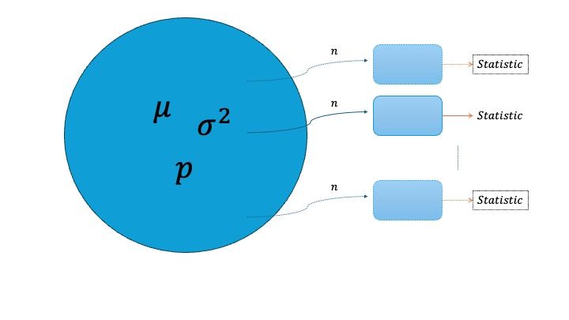

```{r setup, include=FALSE}
knitr::opts_chunk$set(echo = TRUE)
library(ggplot2)
library(dplyr)
```

# **Lab 4: Simulation and probability**

In this lab session, we will explore key concepts of inferential statistics which include sampling distribution and central limit theorem.

------------------------------------------------------------------------

#### Learning Objectives

-   Understand point estimates and sampling variability

-   Visualize and interpret sampling distributions

-   Calculate and interpret standard error

-   Assess data using the normal distribution

-   Apply the law of large numbers and its implications

-   Model data using Bernoulli, Geometric, and Binomial distributions

------------------------------------------------------------------------

## Pre-lab activities

-   We are going to work in groups. This time, each group have 4 people. You can discuss the exercise questions and post-lab activities with your members.

```{r}
num_ppl_each_group = 4
student_list <- read.csv("StudentList.csv")
N <- nrow(student_list)

# Sort by last name
student_list <- student_list %>% arrange(Last)
student_list$number <- 1:N

# Shuffle the student numbers randomly
shuffled <- sample(student_list$number)

# Create group
group_ids <- rep(1:ceiling(N / num_ppl_each_group), num_ppl_each_group)[1:N]

# Assign data frame
group_df <- data.frame(number = shuffled, group = group_ids)
grouped_students <- left_join(group_df, student_list, by = "number")

grouped_students <- grouped_students %>% arrange(group)

# Output
grouped_students %>% select(!number)

```

-   The role of sampling distribution : Why do we care about sampling distribution?

    1.  What is sampling distribution?

    -\> In inferential statistics, we estimate the characteristics of the population parameter by using characteristics of sample (statistic).

    -\> The distribution of the statistic obtained from sample is called sampling distribution.

{width="100%"}

## Lab activities

We have a hypothetical population that are

``` r
pop <- c(rep("Apple", 10), rep("Android", 4))
```

So that the true proportion of having apple device is $p=\frac{10}{14}$.

Let's sample them with $n=5$. What is the sampling distribution look like?

1.  Let's sample them and assign it to an object `p_hat` .

    (hint : use `sample()` and how many are there are apple ?)

```{r}
pop <- c(rep("Apple", 10), rep("Android", 4))
n = 3
my_sample <- sample(pop, n)
p_hat <- sum(my_sample == "Apple") / n
p_hat
```

2.  What is the sampling distribution look like? (obtain a vector `p_hat`)

    (hint : Use `for loop` )

```{r}
K = 100
p_hat <-rep(0,K)

for (k in 1:K){
  my_sample <- sample(pop, n)
  p_hat[k] <- sum(my_sample == "Apple") / n
}
p_hat


```

3.  Using `p_hat` vector, show sampling distribution of the statistic.

```{r}
sample_data <- data.frame(p_hat = p_hat)

ggplot(data=sample_data, aes(x=p_hat)) + geom_histogram(bins=20)


```

4.  Now you are given much bigger hypothetical population where

    ``` r
    pop <- c(rep("Apple", 1000), rep("Android", 400))
    ```

    Now you know that the true population proportion is $p=0.7142$ .

    Let's make a function `my_sample_phat()` to obtain the sample proportion named `p_hat` vector from each sampling (input `n`, output vector `p_hat`).

    ```{r}
    pop <- c(rep("Apple", 1000), rep("Android", 400))

    n = 100
    K = 1000
    p_hat <-rep(0,K)

    for (k in 1:K){
      my_sample <- sample(pop, n)
      p_hat[k] <- sum(my_sample == "Apple") / n
    }
    head(p_hat)


    my_sample_phat <- function(n){
    K = 1000
    p_hat <-rep(0,K)

    for (k in 1:K){
      my_sample <- sample(pop, n)
      p_hat[k] <- sum(my_sample == "Apple") / n
    }
    p_hat

    }

    head(my_sample_phat(10))
    head(my_sample_phat(100))

    ```

5.  Using `my_sample()` function, show the pmf of the sampling distribution of the statistic. Change `n` from 10 to 1000. What do you conclude?

```{r}
library(dplyr)
p_hat = my_sample_phat(1000)

p_hat_data <- data.frame(p_hat = p_hat)


p_hat_data <- p_hat_data %>%
  count(p_hat) %>%
  mutate(pmf = n/sum(n))


mean(p_hat_data$p_hat)
sd(p_hat_data$p_hat)

ggplot(p_hat_data, aes(x=p_hat, y=pmf)) + geom_point() + geom_smooth()


```

Easier version to show the shape is to show histogram of sampled `p_hat`.

```{r}
p_hat = my_sample_phat(1000)
p_hat_data <- data.frame(p_hat = p_hat)
ggplot(data=p_hat_data, aes(x = p_hat)) + geom_histogram(bin=30)


```

Can we also check that $\hat{p}$ follows a certain distribution in other ways?

(hint : 68-95-99.7 rule )

```{r}

p_hat = my_sample_phat(1000)

p_hat_data <- data.frame(p_hat = p_hat)


# boxplot(p_hat_data$p_hat)


ggplot(data=p_hat_data, aes(x=p_hat)) + geom_boxplot()


# summary function 
summary(p_hat_data$p_hat)

# mean
p_hat_mean = mean(p_hat_data$p_hat)

# standard deviation
p_hat_sd = sd(p_hat_data$p_hat)
p_hat_sd


# let's check 68-95-99.7 rule

df <- p_hat_data$p_hat

# within 1 standard deviation
range = (df > (p_hat_mean - 1 * p_hat_sd)) & (df < (p_hat_mean + 1 * p_hat_sd))
df_temp <- df[ range ]
length(df_temp) / length(df)


# within 2 standard deviation
range = (df > (p_hat_mean - 2 * p_hat_sd)) & (df < (p_hat_mean + 2 * p_hat_sd))
df_temp <- df[ range ]
length(df_temp) / length(df)


# within 3 standard deviation
range = (df > (p_hat_mean - 3 * p_hat_sd)) & (df < (p_hat_mean + 3 * p_hat_sd))
df_temp <- df[ range ]
length(df_temp) / length(df)

```

You are given a hypothetical population. Each group should work with different populations. You want to examine how the sample mean, $\hat{\mu} = \frac{1}{n} \sum_{i=1}^{n}x_i$, is distributed when sampling from this population.

Let's set $n= 500$ for all groups. Population parameters are given here.

Population 1 : Normal distribution

```{r}
sigma <- 0.447
N <- 100000
n = 500
pop <- rnorm(N, mean=2, sd=sigma)


```

Population 2 : Bernoulli distribution

```{r}

N <- 100000
n = 500
prob = 0.3
pop <- rbinom(N, 1, prob)


```

Population 3 : Poisson distribution

```{r}
sigma <- 0.447
n = 500
lambda_pois <- sigma^2
pop <- rpois(N, lambda = lambda_pois)
```

Population 4 : Exponential distribution

```{r}
sigma <- 0.447
lambda_exp <- 1 / sigma
pop <- rexp(N, rate = lambda_exp)
```

Population 5 : Gamma Distribution

```{r}
sigma <- 0.447
n = 500
alpha_gamma <- 4  
beta_gamma <- sqrt(alpha_gamma) / sigma
pop <- rgamma(N, shape = alpha_gamma, rate = beta_gamma)
```

Obtain sample of size $n$ from the population and repeat it $K$ times.

```{r}


```

Make the above a function of $n$ (input : `n`, output : $\hat{\mu}$ vector).

```{r}


```

Mean and standard deviation of $\hat{\mu}$.

```{r}


```

Let's check the shape of sampling distribution of $\hat{\mu}$.

Histogram of $\hat{\mu}$

```{r}


```

Check 68-95-99.7 rule to see if the sampling distribution is symmetric, mound shape.

```{r}

#
#
#

```

Let's compare the standard deviations with other groups. What do you conclude?

### Post-lab activities

Recent statistics suggest that 10% of Americans rely on Social Network Sites (SNSs). We are going to have a simulation study if we can verify that CLT really works in this case too. Let's assume that US population is 300,000 for calculation purposes.

Please name your submission as `lab4.R`

0.  execute this `set.seed(213)`

1.  Produce population data and assign it `population` object.

2.  Obtain mean and standard deviation of the population and assign them to `mean_pop` and `sd_pop` accordingly.

3.  Get the sample mean data for $n=10$ with $k=1000$ iterations. Assign the mean and standard deviation of the sample mean data to `mean_sample` and `sd_sample`.

4.  Do one more time with the sample mean data for $n=50$ with $k=100$ iterations. Assign the mean and standard deviation of the sample mean data to `mean_sample2` and `sd_sample2`.

5.  (Extra)

    5.1) Show the shape of the distribution of the sample proportion with n=10, k=1000.

    5.2) Show the shape of the distribution of the sample proportion with n=1000, k=1000.

6.  With $n=1000, K =1000$, assign within 1, 2 and 3 standard deviations of the sample proportion to `first_sd_data`, `second_sd_data` and `third_sd_data`, respectively.
