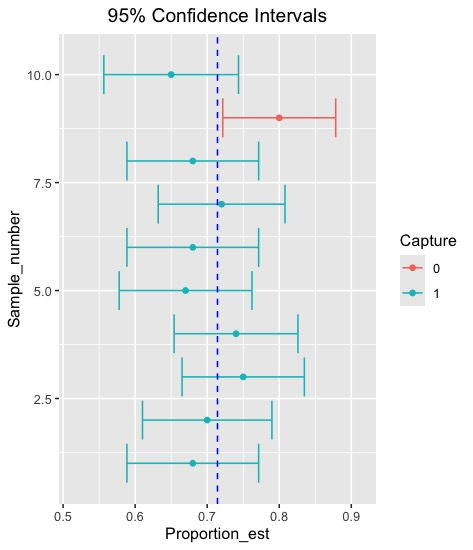

```{r setup, include=FALSE}
knitr::opts_chunk$set(echo = TRUE)
library(ggplot2)
library(gridExtra)
library(dplyr)
```

# **Lab 5: Confidence Interval and Hypothesis Test**

In this lab session, we will explore concepts and applications of confidence interval, hypothesis testing and the Chi-Square test for independence.

#### Learning Objectives

-   **Understand Errors and Significance Levels**: Identify Type I and Type II errors and explain how they are influenced by changes in the significance level.
-   **Calculate Sample Size for Confidence Intervals**: Calculate the required minimum sample size for a given margin of error and confidence level.
-   **Conduct and Interpret Hypothesis Tests for Proportions**: Design, execute, and interpret hypothesis tests for population proportions.
-   **Conduct and Interpret Chi-Square Tests**: Assess whether the conditions for a chi-square test (goodness of fit or independence) are met, and if so, design, execute, and interpret the test.
-   **Explain and Use the t-Distribution**: Explain how the t-distribution differs from the normal distribution and why it is used for population mean inference.
-   **Conduct and Interpret t-Tests**: Design, execute, and interpret t-tests for a single population mean, a difference of paired means, and a difference of independent means, calculating the standard error appropriately for each. Describe how to obtain a p-value for a t-test and a critical t-score for a confidence interval.
-   **Calculate Test Power and Evaluate Factors**: Calculate the power of a test for a given effect size and significance level, and explain how the power would change with variations in effect size, sample size, significance level, or standard error.
-   **Conduct and Interpret ANOVA**: Assess whether conditions for an ANOVA are met, and if so, design, execute, and interpret the test to compare sample means across several groups.

## Pre-lab activities

-   We are going to work in groups. This time, each group have 2 people. You can discuss the exercise questions and post-lab activities with your members.

```{r}
num_ppl_each_group = 2
student_list <- read.csv("StudentList.csv")
N <- nrow(student_list)

# Sort by last name
student_list <- student_list %>% arrange(Last)
student_list$number <- 1:N

# Shuffle the student numbers randomly
shuffled <- sample(student_list$number)

# Create group
group_ids <- rep(1:ceiling(N / num_ppl_each_group), num_ppl_each_group)[1:N]

# Assign data frame
group_df <- data.frame(number = shuffled, group = group_ids)
grouped_students <- left_join(group_df, student_list, by = "number")

grouped_students <- grouped_students %>% arrange(group)

# Output
grouped_students %>% select(!number)

```

## Lab activities

Let's discuss this statement with your group.

### Based on a 2025 Research poll of 1,500 adults, we are 95% confident that between 60% and 64% of Americans believe YouTube has a harmful influence on work and study.

#### Exercise Q1

: What does it mean? Let's discuss what it means.

We are going to make a hypothetical population where people prefer using YouTube and the others hate using YouTube. The total number of population is 1.4 million.

```{r}
#
pop <- c(rep("YouTube", 1000000), rep("No YouTube", 400000))
N <- length(pop)
true_prop = sum(pop == "YouTube") / N

```

Let's sample the data. This time our goal is to make a table as the following

| Number of Simulation | Proportion Estimate | Lower Bound | Upper Bound |
|----------------------|---------------------|-------------|-------------|
| 1                    | 0.75                | 0.6988      | 0.8611      |
| 2                    | 0.63                | 0.6119      | 0.8080      |
| 3                    | 0.77                | 0.6762      | 0.8437      |
| 4                    | 0.72                | 0.6651      | 0.8348      |
| ...                  | ...                 | ...         | ...         |
| K                    | 0.77                | 0.7021      | 0.8012      |

: Sample Simulated CI Table

This means that we are going to construct $K$ confidence intervals. For example, in this plot, we conducted 10 confidence intervals. Nine of them captures the true population proportion while one does not. The dots are the sample proportion estimates.



Let's think about how we do this. Each row (each simulation for an interval), we need to sample from the population and get the proportion estimate, lower bound and upper bound. Once we get those, we need to record them into our dataset table (each row).

#### Exercise Q2

Let's conduct simulation study using the following steps.

1.  Sample $n=100$
2.  Get the estimate
3.  Calculate the lower bound, upper bound
4.  Record them in the dataset
5.  Do these steps (step 1 to 4) $K=1000$ times (1000 rows)

The confidence interval for $p$ is given by

$$
\hat{p} \pm z^{*} \times SE
$$

where $z^{*} = 1.96$ for a 95% CI and

$$
SE = \sqrt{\frac{p(1-p)}{n}   }
$$ We will use the substitution approximation of $p \approx \hat{p}$.

```{r}
# 95% CI 
#
#


```

#### Exercise Q3

We need to add one more column to indicate whether this interval captures the true population proportion. Let's make one more column called `Capture` where it is `TRUE` if it captures the true population parameter, otherwise it is `FALSE`.

```{r}
#
#
#

```

#### Exercise Q4

What percentages of them captures the true population parameter (population proportion)? Show the percentages of the intervals that captures the true population proportion value.

```{r}
#
#
#

```

Plot to show (extra)

```{r}
# CI_95$Capture <- as.factor(CI_95$Capture)
# 
# CI_plot_95 <- CI_95 %>% ggplot(aes(x = Sample_number, y = Proportion_est)) + geom_point(aes(color = Capture)) + geom_errorbar(aes(ymin = Lower, ymax = Upper, color = Capture)) + coord_flip() + geom_hline(yintercept = true_prop, linetype = "dashed", color = "blue") + labs(title = "95% Confidence Intervals") + theme(plot.title = element_text(hjust = 0.5)) + ylim(true_prop - 0.2, true_prop + 0.2)
# 
# 
# CI_plot_95

```

### Testing Hypotheses using confidence intervals

Suppose that a market research company is tasked with determining the percentage of adults in Boston who own cell phones. Two hundred randomly selected residents in Boston are surveyed to answer whether they have cell phones. 127 responded yes to the question "do you have a cell phone?"

#### Exercise Q5

Construct 95% confidence interval for the proportion of Boston residents who have cell phones and interpret the confidence interval you found.

```{r}
#
#
#

```

We want to evaluate whether the proportion of Boston residents who have cell phones is different from 50%. Could you explain from the results above using Statistical language?

---
#
---

### Chi-Square test for independence

Let's explore more on `Titanic` dataset.

```{r}
# loading from csv file
df <- read.csv("titanic.csv")

df2 <- df[,2:3]
head(df2)

```

We want to see whether there is a statistically significant difference in death from passenger class. How do we do it?

Expected Cell Count is

$$
E = \frac{(\text{row total}) \times (\text{column total})}{\text{total sample size}}
$$

Chi-Square Test Statistic $X^2$ is given by

$$
X^{2} = \frac{O_{11} - E_{11}}{E_{11}} + \frac{O_{12} - E_{12}}{E_{12}} + \dots +  \frac{O_{rc} - E_{rc}}{E_{rc}} 
$$

Obtain the p-value using this Chi-Square Test Statistic $X^2$ where degrees of freedom is $df=(r-1) \times (c-1)$ in a two way table.

p-value is $P(\chi^2 \geq X^{2})$

```{r}

draw_chisq_p_value <- function(test_stat, df){
x <- seq(0,25, 0.01)
y <- dchisq(x, df=df)
df_temp <- data.frame(x=x, y=y)
ggplot(data = df_temp, aes(x = x, y = y)) +
  geom_line() +
  geom_area(data = subset(df_temp, x >= test_stat), aes(x = x, y = y), fill = "red", alpha = 0.5)
}

# if the calculated chi-square test statistic is 6 and degrees of freedom is 4
draw_chisq_p_value(6,4)


```

And the actual p-value can be calculated by

```{r}

1-pchisq(5,4)

# or

pchisq(5,4, lower.tail = FALSE)


```

#### Exercise Q6

We are interested in whether survival depends on the class of passengers. Conduct a chi-square test for the data to check whether there is a statistically significant difference in survival based on the class of passengers. (Use a significance level of $\alpha = 0.05$.)

1.  Let's obtain a two way table of `Survived` vs `Pclass` from the dataset.

```{r}
# loading from csv file
df <- read.csv("titanic.csv")


```

2.  Calculate the expected counts for each cell.

```{r}
#
#
#


```

3.  Obtain the p-value using the Chi-Square test statistic.

```{r}
#
#
#


```

## Post-lab activities

Please name your submission as `lab5.R`

1.  Suppose that a market research company is tasked with determining the percentage of adults in Boston who own a bike. Three hundred randomly selected residents in Boston are surveyed to answer whether they have a bike. 180 responded yes to the question "Do you have a bike?"

    Obtain 95% CI for $p$. Assign the lower bound and upper bound of the CI to objects `lower` and `upper`, respectively.

2.  (`Titanic` dataset) We are interested in whether survival depends on the gender of passengers. Conduct a chi-square test for the data to check whether there is a statistically significant difference in survival based on their gender. (Use a significance level of $\alpha = 0.05$.)

    Obtain the Chi-Square test statistic and assign it to object `chisquare`.
