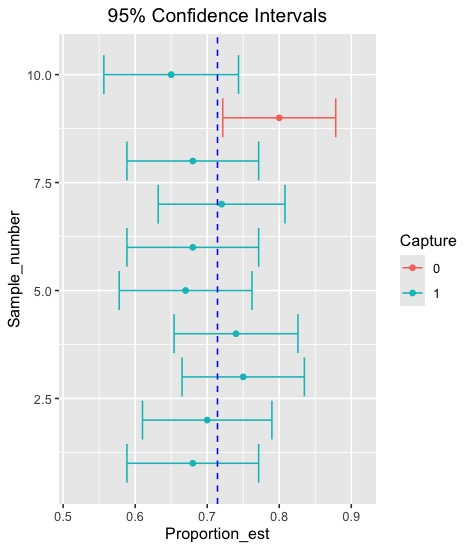
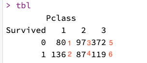

```{r setup, include=FALSE}
knitr::opts_chunk$set(echo = TRUE)
library(ggplot2)
library(dplyr)
```

## Lab 6: **Confidence Interval and Hypothesis Test**

------------------------------------------------------------------------

## Learning Objectives

-   **Understand Errors and Significance Levels**: Identify Type I and Type II errors and explain how they are influenced by changes in the significance level.

-   **Calculate Sample Size for Confidence Intervals**: Calculate the required minimum sample size for a given margin of error and confidence level.

-   **Conduct and Interpret Hypothesis Tests for Proportions**: Design, execute, and interpret hypothesis tests for population proportions.

-   **Conduct and Interpret Chi-Square Tests**: Assess whether the conditions for a chi-square test (goodness of fit or independence) are met, and if so, design, execute, and interpret the test.

-   **Explain and Use the t-Distribution**: Explain how the t-distribution differs from the normal distribution and why it is used for population mean inference.

-   **Conduct and Interpret t-Tests**: Design, execute, and interpret t-tests for a single population mean, a difference of paired means, and a difference of independent means, calculating the standard error appropriately for each. Describe how to obtain a p-value for a t-test and a critical t-score for a confidence interval.

-   **Calculate Test Power and Evaluate Factors**: Calculate the power of a test for a given effect size and significance level, and explain how the power would change with variations in effect size, sample size, significance level, or standard error.

-   **Conduct and Interpret ANOVA**: Assess whether conditions for an ANOVA are met, and if so, design, execute, and interpret the test to compare sample means across several groups.

## Let's discuss this statement.

### Based on a 2025 Research poll of 1,500 adults, we are 95% confident that between 60% and 64% of Americans prefer chocolate ice-cream.

## What does it mean?

It means that we are 95% confident that the true proportion of all people who like chocolate ice cream falls somewhere between 60% and 64%.

## Let's explore its meaning in more detail through a simulation study.

What do we need?

## 1. Population with true proportion


## 2. Sample from the population K times


## 3. The table we want

Our goal is to make a table as the following

| Number of Simulation | Proportion Estimate | Lower Bound | Upper Bound |
|----------------------|---------------------|-------------|-------------|
| 1                    | 0.75                | 0.6988      | 0.8611      |
| 2                    | 0.63                | 0.6119      | 0.8080      |
| 3                    | 0.77                | 0.6762      | 0.8437      |
| 4                    | 0.72                | 0.6651      | 0.8348      |
| ...                  | ...                 | ...         | ...         |
| K                    | 0.77                | 0.7021      | 0.8012      |

: Sample Simulated CI Table

------------------------------------------------------------------------

We are going to make a hypothetical population where people prefer chocolate ice-cream and the others prefer other flavors. The total number of population is 1.4 million. Our interested population parameter is the true proportion of people who like ice-cream flavor.

```{r}
#
pop <- c(rep("Chocolate", 1000000), rep("Other", 400000))
N <- length(pop)
true_prop = sum(pop == "Chocolate") / N
#The number of population
N
#The population parmeter; the true proportion
true_prop
```

We are going to construct $K$ confidence intervals. For example, in this plot, we conducted K=10 confidence intervals with 95% confidence. Nine of them captures the true population proportion while one does not. The dots are the sample proportion estimates.



Let’s think about how to do this. For each row (each simulation for an interval), we need to sample from the population and obtain the proportion estimate, along with the lower and upper bounds. Once we have those, we need to record them in our dataframe (one row per simulation).

## The steps for the simulation study

1.  Sample $n=100$
2.  Get the estimate of the population parameter
3.  Calculate the lower bound, upper bound of the confidence interval
4.  Record them in the dataframe
5.  Do these steps (step 1 to 4) $K=1000$ times (1000 rows)

The confidence interval for $p$ is given by

$$
\hat{p} \pm z^{*} \times SE
$$

where $z^{*} = 1.96$ for a 95% CI and

$$
SE = \sqrt{\frac{p(1-p)}{n}   }
$$ We will use the substitution approximation of $p \approx \hat{p}$.

```{r}
# 95% CI for one sampled data
#
# 
n = 100
sample_data <- sample(pop, n)
p_hat <- sum(sample_data == "Chocolate") / n
p_hat

```

Getting $SE$

```{r}
# SE
SE = sqrt( p_hat * (1-p_hat) /n)
SE


```

Confidence Interval

```{r}
# CI
alpha = 0.05 # for 95% confidence

Lower_bound = p_hat - qnorm(1-alpha/2) * SE
Upper_bound = p_hat + qnorm(1-alpha/2) * SE
CI = c(Lower_bound, Upper_bound)
CI

```

Does it cover the true proportion?

```{r}
# check if true_prop is within CI
CI[1] <= true_prop & true_prop <= CI[2] 

```

We will do these steps K times

```{r}

n = 200
sample_data <- sample(pop, n)
p_hat <- sum(sample_data == "Chocolate") / n
p_hat

SE = sqrt( p_hat * (1-p_hat) /n)
SE

# CI
alpha = 0.05 # for 95% confidence

Lower_bound = p_hat - qnorm(1-alpha/2) * SE
Upper_bound = p_hat + qnorm(1-alpha/2) * SE
CI = c(Lower_bound, Upper_bound)
CI

CI[1] <= true_prop & true_prop <= CI[2] 

```

Let's put them together to make a table

```{r}
pop <- c(rep("Chocolate", 1000000), rep("Other", 400000))
N <- length(pop)
true_prop = sum(pop == "Chocolate") / N
#The number of population
N
#The population parmeter; the true proportion
true_prop


n <- 200
K <- 100
num_of_simulation <- rep(0,K)
prop_est <- rep(0,K)
lower <- rep(0,K)
upper <- rep(0,K)
included  <- rep(0,K)

for (k in 1:K){
  
  
  
  sample_data <- sample(pop, n)
  p_hat <- sum(sample_data == "Chocolate") / n


SE = sqrt( p_hat * (1-p_hat) /n)


# CI
alpha = 0.05 # for 95% confidence

Lower_bound = p_hat - qnorm(1-alpha/2) * SE
Upper_bound = p_hat + qnorm(1-alpha/2) * SE
CI = c(Lower_bound, Upper_bound)

num_of_simulation[k] = k
prop_est[k] <- p_hat
lower[k] <- CI[1]
upper[k] <- CI[2]
included[k] <- CI[1] <= true_prop & true_prop <= CI[2] 

}


# bind together
df_table <- data.frame(num_of_simulation = num_of_simulation, prop_est = prop_est, lower = lower, upper = upper, included = included)

head(df_table)

```

What percentage of the confidence interval cover the true proportion?

```{r}
sum(df_table$included)/K 

print( paste0(sum(df_table$included)/K*100, "%"))

```

------------------------------------------------------------------------

## Exercises: Confidence Intervals

**Exercise 1.** In the simulation above, we used $n = 200$ and $K = 100$ with a 95% confidence level.

a.  Change the sample size to $n = 50$ and re-run the simulation. What percentage of intervals captured the true proportion? How does this compare to the $n = 200$ result?

```{r}

# TODO : a

pop <- c(rep("Chocolate", 1000000), rep("Other", 400000))
N <- length(pop)
true_prop <- sum(pop == "Chocolate") / N

run_ci_simulation <- function(n, K, alpha) {
  included <- rep(0, K)
  for (k in 1:K) {
    sample_data <- sample(pop, n)
    p_hat <- sum(sample_data == "Chocolate") / n
    SE <- sqrt(p_hat * (1 - p_hat) / n)
    lower <- p_hat - qnorm(1 - alpha / 2) * SE
    upper <- p_hat + qnorm(1 - alpha / 2) * SE
    included[k] <- lower <= true_prop & true_prop <= upper
  }
  return(sum(included) / K)
}

set.seed(42)
coverage_n50  <- run_ci_simulation(n = 50,  K = 100, alpha = 0.05)
coverage_n200 <- run_ci_simulation(n = 200, K = 100, alpha = 0.05)

print(paste0("Coverage with n=50:  ", coverage_n50  * 100, "%"))
print(paste0("Coverage with n=200: ", coverage_n200 * 100, "%"))


```

b.  Now change the confidence level to 90% (i.e., set `alpha = 0.10`) while keeping $n = 200$. What percentage of intervals captured the true proportion? Is this what you expected? Explain.

```{r}

# TODO : b
coverage_90 <- run_ci_simulation(n = 200, K = 100, alpha = 0.10)
print(paste0("Coverage at 90% confidence: ", coverage_90 * 100, "%"))


```

c.  Keeping $n = 200$ and 95% confidence, increase $K$ to 1000. Does the coverage percentage get closer to 95%? Why or why not?

```{r}

# TODO : c
coverage_K1000 <- run_ci_simulation(n = 200, K = 1000, alpha = 0.05)
print(paste0("Coverage with K=1000: ", coverage_K1000 * 100, "%"))


```

Yes, with more simulations the coverage percentage converges closer to 95%. By the Law of Large Numbers, the empirical coverage rate approaches the theoretical 95% as $K \to \infty$.

------------------------------------------------------------------------

**Exercise 2. (no R code)** The simulation poll at the top of the guide reported: *"We are 95% confident that between 60% and 64% of Americans prefer chocolate ice cream."*

A classmate says: *"This means 95% of Americans prefer chocolate ice cream with probability between 60% and 64%."* Is this interpretation correct? If not, write a correct interpretation.

=\> Answer

------------------------------------------------------------------------

## Testing for independence in two-way tables

Let's explore more on `Titanic` dataset.

```{r}
# loading from csv file
df <- read.csv("titanic.csv")

df2 <- df[,2:3]
head(df2)

unique(df2$Survived)
unique(df2$Pclass)
```

```{r}

tbl <- table(df2)
tbl

```

We want to see whether there is a statistically significant difference in death from passenger class. How do we do it?

Expected Cell Count is

$$
E = \frac{(\text{row total}) \times (\text{column total})}{\text{total sample size}}
$$

Chi-Square Test Statistic $X^2$ is given by

$$
X^{2} = \frac{(O_{11} - E_{11})^2}{E_{11}} + \frac{(O_{12} - E_{12})^2}{E_{12}} + \dots +  \frac{(O_{rc} - E_{rc})^2}{E_{rc}} 
$$

Obtain the p-value using this Chi-Square Test Statistic $X^2$ where degrees of freedom is $df=(r-1) \times (c-1)$ in a two way table.

$H_0$ : There is no difference in the survival of the three different classes

$H_a$ : There is some difference in the survival between three classes

p-value is $P(\chi^2 \geq X^{2})$

Let's obtain all expected cell counts.

This is how index for the table works.



```{r}
# either you get from 
row1sum = tbl[1] + tbl[3] + tbl[5]
row2sum = tbl[2] + tbl[4] + tbl[6]

col1sum = tbl[1] + tbl[2]
col2sum = tbl[3] + tbl[4]
col3sum = tbl[5] + tbl[6]
total = sum(tbl)


row1sum
row2sum
col1sum
col2sum
col3sum
total


```

Or you can simply use

```{r}


tbl2 <- addmargins(tbl)
tbl2

```

Using the values you calculated, we can obtain expected count for each cell

```{r}
# Calculate expected counts for each cell
e11 = row1sum * col1sum / total
e12 = row1sum * col2sum / total
e13 = row1sum * col3sum / total
e21 = row2sum * col1sum / total
e22 = row2sum * col2sum / total
e23 = row2sum * col3sum / total

# Create 2x3 matrix of expected counts, filled by row
expected_tbl = matrix(data = c(e11, e21, e12, e22, e13, e23),
                      nrow = 2, ncol = 3) 

# Print the expected table
expected_tbl


```

Let's compute the chi-square statistic

```{r}

statistic <- 0
for (i in 1:6){
  statistic <- statistic + (tbl[i] - expected_tbl[i])^2/expected_tbl[i]
}
statistic


```

What is the p-value?

```{r}

draw_chisq_p_value <- function(test_stat, df){
x <- seq(0,25, 0.01)
y <- dchisq(x, df=df)
df_temp <- data.frame(x=x, y=y)
ggplot(data = df_temp, aes(x = x, y = y)) +
  geom_line() +
  geom_area(data = subset(df_temp, x >= test_stat), aes(x = x, y = y), fill = "red", alpha = 0.5)
}

# if the calculated chi-square test statistic is 6 and degrees of freedom is 4
# draw_chisq_p_value(6,4)
```

```{r}
df = (2-1)*(3-1)
df
pvalue = 1-pchisq(statistic, df)
pvalue
draw_chisq_p_value(statistic,df)
```

------------------------------------------------------------------------

## Exercises: Chi-Square Test of Independence

**Exercise 4.** Using the Titanic dataset and the chi-square test you ran above:

a.  State the degrees of freedom for this test and explain how they were calculated.

setting

```{r}
df_titanic <- read.csv("titanic.csv")
df2 <- df_titanic[, 2:3]
tbl <- table(df2)
tbl2 <- addmargins(tbl)
tbl2
```

**a. Degrees of freedom**

```{r}
r <- nrow(tbl)
c <- ncol(tbl)
dof <- (r - 1) * (c - 1)
print(paste0("Degrees of freedom = (", r, "-1) x (", c, "-1) = ", dof))
```

b.  At a significance level of $\alpha = 0.05$, what is your conclusion? Write it out in a full sentence in the context of the problem (i.e., mention passenger class and survival).

```{r}
# Recompute statistic for reference
row1sum <- tbl2[1, 4]; row2sum <- tbl2[2, 4]
col1sum <- tbl2[3, 1]; col2sum <- tbl2[3, 2]; col3sum <- tbl2[3, 3]
total   <- tbl2[3, 4]

expected_tbl <- matrix(
  c(row1sum * col1sum / total, row2sum * col1sum / total,
    row1sum * col2sum / total, row2sum * col2sum / total,
    row1sum * col3sum / total, row2sum * col3sum / total),
  nrow = 2, ncol = 3)

statistic <- sum((tbl - expected_tbl)^2 / expected_tbl)
pvalue <- 1 - pchisq(statistic, df = 2)

print(paste0("Chi-square statistic = ", round(statistic, 4)))
print(paste0("p-value = ", round(pvalue, 6)))
```

**Answer:** Since the p-value is much less than $\alpha = 0.05$, we **reject** $H_0$. There is statistically significant evidence that survival rate differs across the three passenger classes on the Titanic.

**Exercise 5.** Now explore the relationship between **survival and sex** (`Survived` and `Sex` columns) in the Titanic dataset.

a.  Create a two-way contingency table for `Survived` vs. `Sex`.

```{r}
df3 <- data.frame(Survived = df_titanic$Survived, Sex = df_titanic$Sex)
tbl_sex <- table(df3)
tbl_sex
tbl_sex2 <- addmargins(tbl_sex)
tbl_sex2
```

b.  Manually calculate all expected cell counts. Do all cells meet the condition $E \geq 5$? (This is required for the chi-square test to be valid.)

```{r}
row1s <- tbl_sex2[1, 3]   # Survived = 0 total
row2s <- tbl_sex2[2, 3]   # Survived = 1 total
col1s <- tbl_sex2[3, 1]   # female total
col2s <- tbl_sex2[3, 2]   # male total
tots  <- tbl_sex2[3, 3]   # grand total

e11s <- row1s * col1s / tots   # Survived=0, female
e12s <- row1s * col2s / tots   # Survived=0, male
e21s <- row2s * col1s / tots   # Survived=1, female
e22s <- row2s * col2s / tots   # Survived=1, male

expected_sex <- matrix(c(e11s, e21s, e12s, e22s), nrow = 2, ncol = 2)
print("Expected counts:")
print(expected_sex)
print(paste0("All expected counts >= 5: ", all(expected_sex >= 5)))
```

c.  Compute the chi-square test statistic and p-value. What do you conclude at $\alpha = 0.05$?

```{r}
statistic <- sum((tbl_sex - expected_sex)^2 / expected_sex)
dof <- (nrow(tbl_sex) - 1) * (ncol(tbl_sex) - 1)
pvalue <- 1 - pchisq(statistic_sex, df = dof_sex)

statistic
dof
pvalue
```
